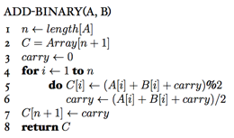

### Exercises 2.1-1
***
Using Figure 2.2 as a model, illustrate the operation of INSERTION-SORT on the array A = [31, 41, 59, 26, 41, 58].

### `Answer`

### Exercises 2.1-2
***
Rewrite the INSERTION-SORT procedure to sort into nonincreasing instead of nondecreasing order.

### `Answer`

### Exercises 2.1-3
***
Consider the searching problem:

* **Input**: A sequence of n numbers A = [a1, a2, . . . , an] and a value v.
* **Output**: An index i such that v = A[i] or the special value NIL if v does not appear in A.


Write pseudocode for **linear search**, which scans through the sequence, looking for v. Using a loop invariant, prove that your algorithm is correct. Make sure that your loop invariant fulfills the three necessary properties.

### `Answer`

Loop Invariant: all elements in subarray  A[1:j-1] (all elements before index j) do not equal to v.

Proof:

* **Initialization**: j = 1 when the loop begins and subarray A[1:j-1] is empty (note that the index starts from 1 not 0). Thus, it is a vacuous truth.
* **Maintainance**:  The body of **for** loop works by checking A[j], A[j+1], A[j+2], and so on by one position to the right until the value equals to v is finded, at which point the loop would end by returning the value. The subarray of A[1:j-1] consists of values that has already been investigated, since the loop hasn't turned to terminate. We know the loop invariant is maintained.
* **Termination**: There are two cases which lead to termination:
   1. The value equals to v has been found (line 3): The value equals to v is found at index j, and it must be the first time value equals to v is founded or the loop would terminate ealier. Thus, all elements investiagted before (A[1:j-1]) do not contain v. The loop invariant holds. 
         
   2. The value has not been found after investigating every element in the sequence (line 4): Since every element is checked and v is not found, the loop invariant must be true.

### Exercises 2.1-4
***
Consider the problem of adding two n-bit binary integers, stored in two n-element arrays A and B. The sum of the two integers should be stored in binary form in an (n + 1)-element array C. State the problem formally and write pseudocode for adding the two integers.

### `Answer`

***
Follow [@louis1992](https://github.com/gzc) on github to help finish this task.

