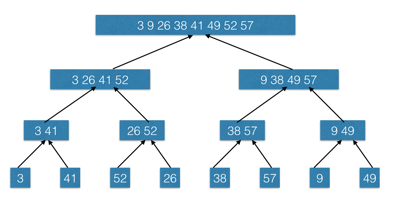
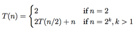
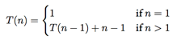

### Exercises 2.3-1
***
Using Figure 2.4 as a model, illustrate the operation of merge sort on the array A = [3, 41, 52, 26, 38, 57, 9, 49].

### `Answer`



### Exercises 2.3-2
***
Rewrite the MERGE procedure so that it does not use sentinels, instead stopping once either array L or R has had all its elements copied back to A and then copying the remainder of the other array back into A.

### `Answer`
[code](./exercise_code/merge-sort.py)


### Exercises 2.3-3
***
Use mathematical induction to show that when n is an exact power of 2, the solution of the recurrence
 is =n\\lg{n})

1.定义 =T\(2^k\))

2.当k = 1时，=T\(2\)=2=2\lg{2}=2^1\lg{2^1})

3.假设=2^k\\lg{2^k})

4.=T\(2^{k+1}\)=2T\(2^k\)+2^{k+1})

)

=2^{k+1}\lg{2^{k+1}})

### `Answer`
[code](./exercise_code/merge-sort.py)


### Exercises 2.3-4
***
Insertion sort can be expressed as a recursive procedure as follows. In order to sort A[1..n], we recursively sort A[1..n -1] and then insert A[n] into the sorted array A[1..n - 1]. Write a recurrence for the running time of this recursive version of insertion sort.

### `Answer`


### Exercises 2.3-5
***
Referring back to the searching problem (see Exercise 2.1-3), observe that if the sequence A is sorted, we can check the midpoint of the sequence against v and eliminate half of the sequence from further consideration. **Binary search** is an algorithm that repeats this procedure, halving the size of the remaining portion of the sequence each time. Write pseudocode, either iterative or recursive, for binary search. Argue that the worst-case running time of binary search is Θ(lg n).
### `Answer`


[python code](./exercise_code/binary-search.py)


### Exercises 2.3-6
***
Observe that the while loop of lines 5 - 7 of the **INSERTION-SORT** procedure in Section 2.1 uses a linear search to scan (backward) through the sorted subarray A[1..j - 1]. Can we use a binary search (see Exercise 2.3-5) instead to improve the overall worst-case running time of insertion sort to Θ(n lg n)?

### `Answer`
不可以，查找可以达到对数级的，但是依然要移动元素，依然是线性的.

Although we can reduce the number of comparisons by using binary search, we still need to shift all the elements greater than key towards the end of the array to insert key. And this shifting of elements runs at Θ(n) time, even in average case (as we need to shift half of the elements). So, the overall worst-case running time of insertion sort will still be Θ(n^2).

Pseudo-code:
```
A = [1 .. n];

selectionSort(A){
	for (i = 2) to (i = n)
		// find the correct position of A[i] in array A[1 .. i-1]
		pos = binarySearch(1,i-1,A[i]);
    		// shifting of elements to place A[i] in its correct position pos
		for (j = i-1) to (j = pos)
			temp = A[j+1];
			A[j+1] = A[j];
			A[j] = temp;
		endfor
	endfor
}

binarySearch(low,high,v)
	mid = (low + high) / 2;
	// we are not looking for the value v explicitly, but for its correct position
	if (v >= A[mid] && v < A[mid+1])
		return mid
	else
		if (v < A[mid])
			return binarySearch(low,mid,v)
		else
			return binarySearch(mid,high,v)
		endif
	endif
```

[python code](./exercise_code/Insertion_sort_with_binary_search.py) 

### Exercises 2.3-7
***
Describe a Θ(n lg n)-time algorithm that, given a set S of n integers and another integer x,
determines whether or not there exist two elements in S whose sum is exactly x.


先用mergesort进行排序，然后两根指针分别在集合的头和尾，往中间扫描～


这个题目可以利用哈希表（散列表）达到O(n),[my code](https://github.com/gzc/leetcode/blob/master/cpp/001-010/Two%20Sum.cpp)

***
Follow [@louis1992](https://github.com/gzc) on github to help finish this task.

