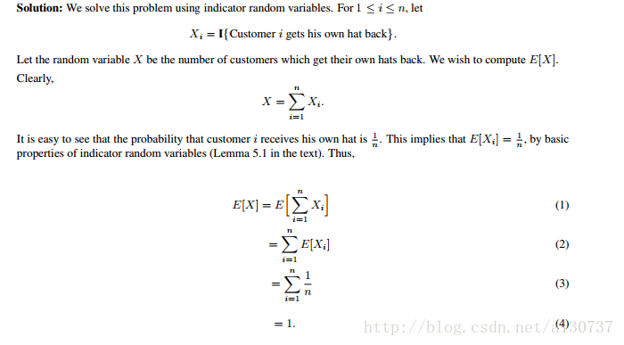

### Exercises 5.2-1
***
In HIRE-ASSISTANT, assuming that the candidates are presented in a random order, what is the probability that you will hire exactly one time? What is the probability that you will hire exactly n times?

### `Answer`
分别是1/n和1/n!

### Exercises 5.2-2
***
In HIRE-ASSISTANT, assuming that the candidates are presented in a random order, what is the probability that you will hire exactly twice?

### `Answer`
如果第一个雇员的质量是k,那么质量高于k的雇员都必须在质量最高的雇员后面.

假设有n个雇员，质量分别是1,2,...,n.当第一个质量为k时，只雇佣2次的概率p = 1/(n-k).因为有n-k个质量比k高的，而且必须要最高的那个在前.而第一个质量为k的概率是1/n.所以

### Exercises 5.2-3
***
Use indicator random variables to compute the expected value of the sum of n dice.

### `Answer`
Expectation of a single die 

%20=%20\\frac{1+2+3+4+5+6}{6}%20=%203.5%20%20)

Expectation of N dies

%20=%20\\sum_{i%20=%201}^{n}%20E\(X_i\)%20=%203.5n%20)

### Exercises 5.2-4
***
Use indicator random variables to solve the following problem, which is known as the **hat- check problem**. Each of n customers gives a hat to a hat-check person at a restaurant. The hat- check person gives the hats back to the customers in a random order. What is the expected number of customers that get back their own hat?

### `Answer`

### Exercises 5.2-5
***
Let A[1...n] be an array of n distinct numbers. If i < j and A[i] > A[j], then the pair (i, j) is called an inversion of A. (See Problem 2-4 for more on inversions.) Suppose that each element of A is chosen randomly, independently, and uniformly from the range 1 through n. Use indicator random variables to compute the expected number of inversions.

### `Answer`
最简单的解法如下:

因为概率是一样的，所以出现正序和逆序是等量的，总共有n(n-1)/2对，所以期望是n(n-1)/4对.

Explaination:
Let I{A} be an indicator random variable defined as: 1, if a given pair in array is inversion; 0 if it pair is not inversion.

Then we know that E[I{A}] = P{A} i.e. Execpecation of above randon variable is same as probability of event A.

Now, since the numbers in array are **distinct** (_this is important_) and are **uniform random permutations** then the probability of event A is 1/2.

let X be a random varaible giving us number of inversions in array. Y is random variable that a given pair is inversion. And let there be k such pairs, then 

sum over all k.

And you might have guessed already 

By linearity of expectation:

Hence

***
Follow [@louis1992](https://github.com/gzc) on github to help finish this task.

