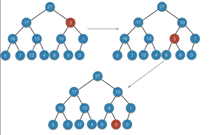

### Exercises 6.2-1
***
Using Figure 6.2 as a model, illustrate the operation of MAX-HEAPIFY(A, 3) on the array A = 27,17, 3, 16, 13, 10, 1, 5, 7, 12, 4, 8, 9, 0.

### `Answer`

### Exercises 6.2-2
***
Starting with the procedure MAX-HEAPIFY, write pseudocode for the procedure MIN- HEAPIFY(A, i), which performs the corresponding manipulation on a min-heap. How does the running time of MIN-HEAPIFY compare to that of MAX-HEAPIFY?

### `Answer`

	MIN-HEAPIFY(A, i):
		l <- LEFT(i)
		r <- RIGHT(i)
		smallest <- i
		if l ≤ heap-size[A] and A[l] < A[i]:
			then smallest <- l
		if r ≤ heap-size[A] and A[r] < A[smallest]:
			then smallest <- r
		if smallest ≠ i:
			then swap(A[i], A[smallest])
			     MIN-HEAPIFY(A, smallest)

### Exercises 6.2-3
***
What is the effect of calling MAX-HEAPIFY(A, i) when the element A[i] is larger than its children?

### `Answer`
函数直接返回.

Just return.

### Exercises 6.2-4
***
What is the effect of calling MAX-HEAPIFY(A, i) for i > heap-size[A]/2?

### `Answer`
这种情况下，这个节点是叶子节点.

Under this condition, this node is a leaf node.

### Exercises 6.2-5
***
The code for MAX-HEAPIFY is quite efficient in terms of constant factors, except possibly for the recursive call in line 10, which might cause some compilers to produce inefficient code. Write an efficient MAX-HEAPIFY that uses an iterative control construct (a loop) instead of recursion.

### `Answer`

	MIN-HEAPIFY(A, i):
		while i ≤ heap-size[A]:
			l <- LEFT(i)
			r <- RIGHT(i)
			largest <- i
			if l ≤ heap-size[A] and A[l] > A[i]:
				then largest <- l
			if r ≤ heap-size[A] and A[r] > A[largest]:
				then largest <- r
			if largest ≠ i:
				then swap(A[i], A[largest])
					 i = largest
			else break

### Exercises 6.2-6
***
Show that the worst-case running time of MAX-HEAPIFY on a heap of size n is Ω(lg n). (Hint: For a heap with n nodes, give node values that cause MAX-HEAPIFY to be called recursively at every node on a path from the root down to a leaf.)

### `Answer`
最坏情况是从root一直递归到leaf,因为heap的高度为⌞lg n⌟,所以最坏运行时间是Ω(lgn).

In the worst case, this function will call until the leaf node.

***
Follow [@louis1992](https://github.com/gzc) on github to help finish this task.

