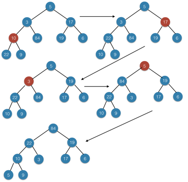

### Exercises 6.3-1
***
Using Figure 6.3 as a model, illustrate the operation of BUILD-MAX-HEAP on the array A = [5, 3, 17, 10, 84, 19, 6, 22, 9].

### `Answer`

### Exercises 6.3-2
***
Why do we want the loop index i in line 2 of BUILD-MAX-HEAP to decrease from ⌞length[A]/2⌟ to 1 rather than increase from 1 to ⌞length[A]/2⌟?

### `Answer`
如果先从1开始，它的子树并不是最大堆，肯定不能这样迭代.

If we start from 1, because its subtree is not a maximum heap, we can't follow this order.

### Exercises 6.3-3
***
Show that there are at most %20\\rceil) nodes of height h in any n-element heap.

### `Answer`
According to [6.1.1](./6.1.md)we have

Mark h0 as the height of tree.

%20\\rceil%20\\le%20\\lceil%20\(2^{h_0+1}-1\)/\(2^{h+1}\)%20\\rceil%20=%202^{h_0-h})

If the current layer is full, then we have equal. If in the leaf node and not full, we have less.

***
Follow [@louis1992](https://github.com/gzc) on github to help finish this task.

