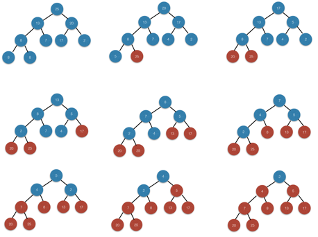

### Exercises 6.4-1
***
Using Figure 6.4 as a model, illustrate the operation of HEAPSORT on the array A = [5, 13, 2, 25, 7, 17, 20, 8, 4].

### `Answer`

### Exercises 6.4-2
***
Argue the correctness of HEAPSORT using the following loop invariant:

• At the start of each iteration of the for loop of lines 2-5, the subarray A[1...i] is a max-heap containing the i smallest elements of A[1...n], and the subarray A[i + 1...n] contains the n - i largest elements of A[1...n], sorted.

### `Answer`
It is very obvious.

### Exercises 6.4-3
***
What is the running time of heapsort on an array A of length n that is already sorted in increasing order? What about decreasing order?

### `Answer`
If the array is in descending order, then we have the worst case, we need

%20)

If it is in increasing order, we still need%20),Because the cost of Max_heapify doesn't change.

### Exercises 6.4-4
***
Show that the worst-case running time of heapsort is Ω(n lg n).

### `Answer`
Same as 6.3.3.

### Exercises 6.4-5
***
Show that when all elements are distinct, the best-case running time of heapsort is Ω(n lg n).

### `Answer`
It is actually a hard problem, see [solution](http://stackoverflow.com/questions/4589988/lower-bound-on-heapsort)

***
Follow [@louis1992](https://github.com/gzc) on github to help finish this task.

