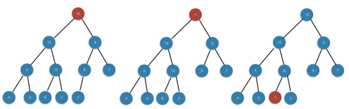
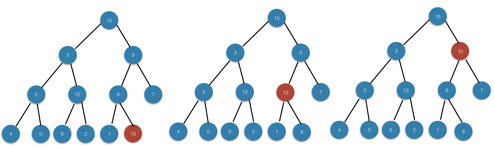

### Exercises 6.5-1
***
Illustrate the operation of HEAP-EXTRACT-MAX on the heap A = [15, 13, 9, 5, 12, 8, 7, 4, 0, 6, 2, 1].


### `Answer`



### Exercises 6.5-2
***
Illustrate the operation of MAX-HEAP-INSERT(A, 10) on the heap A = [15, 13, 9, 5, 12, 8,
7, 4, 0, 6, 2, 1]. Use the heap of Figure 6.5 as a model for the HEAP-INCREASE-KEY call.


### `Answer`


### Exercises 6.5-3
***
Write pseudocode for the procedures HEAP-MINIMUM, HEAP-EXTRACT-MIN, HEAP- DECREASE-KEY, and MIN-HEAP-INSERT that implement a min-priority queue with a min-heap.

### `Answer`
My implementation on priority queue.

[p_queue.h](./p_queue.h)

[p_queue.cpp](./p_queue.cpp)


### Exercises 6.5-4
***
Why do we bother setting the key of the inserted node to -∞ in line 2 of MAX-HEAP- INSERT when the next thing we do is increase its key to the desired value?

### `Answer`
keey the HEAP-INCREASE-KEY condition still holds.

### Exercises 6.5-5
***
Argue the correctness of HEAP-INCREASE-KEY using the following loop invariant:

• At the start of each iteration of the while loop of lines 4-6, the array A[1...heap- size[A]] satisfies the max-heap property, except that there may be one violation: A[i] may be larger than A[PARENT(i)].

### `Answer`
obvious loop-invariant.

### Exercises 6.5-6
***
Each exchange operation on line 5 of HEAP-INCREASE-KEY typically requires three asignments. Show how to use the idea of the inner loop of INSERTION-SORT to reduce the three assignments down to just one assignment.

### `Answer`
	HEAP-INCREASE-KEY(A, i, key):
		if key < A[i]
			error "New key is smaller than current key"
		A[i] = key
		while i > 1 and A[PARENT(i)] < key
			A[i] = A[PARENT(i)]
			i = PARENT(i)
		A[i] = key

### Exercises 6.5-7
***
Show how to implement a first-in, first-out queue with a priority queue. Show how to
implement a stack with a priority queue. (Queues and stacks are defined in Section 10.1.)

### `Answer`

* 先进先出队列: 每次都给新插入的元素赋予更低的优先级即可.
* 栈：每次都给新插入的元素赋予更高的优先级.

* First-in, first-out queue: Assign a lower priority to the newly inserted element.
* stack：Assign a higher priority to the newly inserted element.

### Exercises 6.5-8
***
The operation HEAP-DELETE(A, i) deletes the item in node i from heap A. Give an
implementation of HEAP-DELETE that runs in O(lg n) time for an n-element max-heap.

### `Answer`

```c
HEAP-DELETE(A, i):
	if A[i] < A[A.heap-size]
		HEAP-INCREASE-KEY(A, i, A[A.heap-size])
		A.heap-size -= 1
	else
		A[i] = A[A.heap-size]
		A.heap-size -= 1
		MAX-HEAPIFY(A,i)
```
**Notice: What's wrong with the implementation bellow?**
	
```c
HEAP-DELETE(A, i):
	A[i] = A[A.heap-size]
	A.heap-size -= 1
	MAX-HEAPIFY(A, i)
```
You can't assume there always be A[i] > A[A.heap-size].
For example:
```
      10
    /    \
   5      9
  / \    / \
 2   3  7   8
```
If you want to delete key 2, the A[A.heap-size] is 8. But 8 should climb up to the position of 5.

### Exercises 6.5-9
***
Give an O(n lg k)-time algorithm to merge k sorted lists into one sorted list, where n is the
total number of elements in all the input lists. (Hint: Use a min-heap for k-way merging.)

### `Answer`
The problem occurs in [leetcode](https://leetcode.com/problems/merge-k-sorted-lists/)

This is my [solution](https://github.com/gzc/leetcode/blob/master/cpp/021-030/Merge%20k%20Sorted%20Lists%20.cpp)


***
Follow [@louis1992](https://github.com/gzc) on github to help finish this task.

