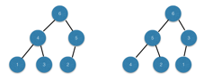

### Problems 1 : Building a heap using insertion
***
The procedure BUILD-MAX-HEAP in Section 6.3 can be implemented by repeatedly using MAX-HEAP-INSERT to insert the elements into the heap. Consider the following implementation:

	BUILD-MAX-HEAP'(A)
		heap-size[A] ← 1
		for i←2 to length[A]
			do MAX-HEAP-INSERT(A, A[i])

			
a. Do the procedures BUILD-MAX-HEAP and BUILD-MAX-HEAP' always create the same heap when run on the same input array? Prove that they do, or provide a counterexample.

b. Show that in the worst case, BUILD-MAX-HEAP' requires Θ(n lg n) time to build an n-element heap.

### `Answer`
**a.**
不一定.对于数组[1,2,3,4,5,6].有

**b.**
当原数组是递增序列时，需要的时间

%20)

### Problems 2 : Analysis of d-ary heaps
***
A d-ary heap is like a binary heap, but (with one possible exception) non-leaf nodes have d children instead of 2 children.

a. How would you represent a d-ary heap in an array?

b. What is the height of a d-ary heap of n elements in terms of n and d?

c. Give an efficient implementation of EXTRACT-MAX in a d-ary max-heap. Analyze
its running time in terms of d and n.

d. Give an efficient implementation of INSERT in a d-ary max-heap. Analyze its running
time in terms of d and n.

e. Give an efficient implementation of INCREASE-KEY(A, i, k), which first sets A[i] ←
max(A[i], k) and then updates the d-ary max-heap structure appropriately. Analyze its running time in terms of d and n.
	
### `Answer`
[implementation](./d-ary-heaps.cpp)

### Problems 3 : Young tableaus
***
An m × n Young tableau is an m × n matrix such that the entries of each row are in sorted order from left to right and the entries of each column are in sorted order from top to bottom. Some of the entries of a Young tableau may be ∞, which we treat as nonexistent elements. Thus, a Young tableau can be used to hold r ≤ mn finite numbers.

a. Draw a 4×4 Young tableau containing the elements {9, 16, 3, 2, 4, 8, 5, 14, 12}.

b. Arguethatanm×nYoungtableauYisemptyifY[1,1]=∞.ArguethatYisfull
(contains mn elements) if Y[m, n] < ∞.

c. Give an algorithm to implement EXTRACT-MIN on a nonempty m × n Young
tableau that runs in O(m + n) time. Your algorithm should use a recursive subroutine that solves an m × n problem by recursively solving either an (m - 1) × n or an m × (n - 1) subproblem. (Hint: Think about MAX-HEAPIFY.) Define T(p), where p = m + n, to be the maximum running time of EXTRACT-MIN on any m × n Young tableau. Give and solve a recurrence for T(p) that yields the O(m + n) time bound.

d. Show how to insert a new element into a nonfull m × n Young tableau in O(m + n) time.

e. Using no other sorting method as a subroutine, show how to use an n × n Young tableau to sort n^2 numbers in O(n^3) time.

f. Give an O(m+n)-time algorithm to determine whether a given number is stored in a given m × n Young tableau.

### `Answer`

[implementation](./young.cpp)

**a.**

**b.**

这是显然的~

**c.**
T(p) = T(p-1) + O(1) = O(p)

**d.**
跟c是一个相反的操作，具体见代码.

**e.**
%20%20=%20O\(n^3\))

**f.**
实现见代码.

 
***
Follow [@louis1992](https://github.com/gzc) on github to help finish this task.

