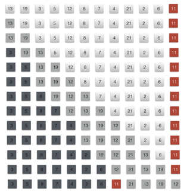

### Exercises 7.1-1
***
Using Figure 7.1 as a model, illustrate the operation of PARTITION on the array A = [13, 19, 3, 5, 12, 8, 7, 4, 21, 2, 6, 11].

### `Answer`

### Exercises 7.1-2
***
What value of q does PARTITION return when all elements in the array A[p...r] have the same value? Modify PARTITION so that q = (p+r)/2 when all elements in the array A[p...r] have the same value.

### `Answer`
It will return r. So we have to modify the code in case the worst situation.

[code](./exercise_code/quicksort.py)

### Exercises 7.1-3
***
Give a brief argument that the running time of PARTITION on a subarray of size n is Θ(n).

### `Answer`
Because we just iterate the array once.

### Exercises 7.1-4
***
How would you modify QUICKSORT to sort into nonincreasing order?

### `Answer`
Change the condition **A[j] <= x** to **A[j] >= x**

***
Follow [@louis1992](https://github.com/gzc) on github to help finish this task.

