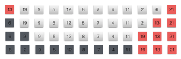

### Problems 1 : Hoare partition correctness
***
The version of PARTITION given in this chapter is not the original partitioning algorithm. Here is the original partition algorithm, which is due to T. Hoare:

	HOARE-PARTITION(A, p, r):
		x <- A[p]
		i <- p - 1
		j <- r + 1
		while TRUE:
			do repeat j <- j - 1
					until A[j] <= x
			   repeat i <- i + 1
					until A[i] >= x
			   if i < j:
			   		then exchange A[i] <-> A[j]
			   		else return j
			   		
			   		
**a.** Demonstrate the operation of HOARE-PARTITION on the array A = [13, 19, 9, 5, 12, 8, 7, 4, 11, 2, 6, 21], showing the values of the array and auxiliary values after each iteration of the for loop in lines 4-11.

The next three questions ask you to give a careful argument that the procedure HOARE- PARTITION is correct. Prove the following:

**b.** The indices i and j are such that we never access an element of A outside the subarray A[p...r].

**c.** When HOARE-PARTITION terminates, it returns a value j such that p ≤ j < r.

**d.** Every element of A[p...j] is less than or equal to every element of A[j+1...r] when
HOARE-PARTITION terminates.

The PARTITION procedure in Section 7.1 separates the pivot value (originally in A[r]) from the two partitions it forms. The HOARE-PARTITION procedure, on the other hand, always places the pivot value (originally in A[p]) into one of the two partitions A[p...j] and A[j + 1...r]. Since p ≤ j < r, this split is always nontrivial.

**e.** Rewrite the QUICKSORT procedure to use HOARE-PARTITION.

### `Answer`
**a.**

**b.**

这是肯定的，因为i,j是往中间靠拢的.

**c.**
j至少会减2次. 若第一次进入while，j只减了1次，那么会做一次swap.然后继续进入while.

**d.**

很显然，小于x的放前面了，大于等于x的在后面.

**e.**

[implementation](./exercise_code/hoare.py)

### Problems 2 : Alternative quicksort analysis
***
An alternative analysis of the running time of randomized quicksort focuses on the expected running time of each individual recursive call to QUICKSORT, rather than on the number of comparisons performed.

**a.** Argue that, given an array of size n, the probability that any particular element is chosen as the pivot is 1/n. Use this to define indicator random variables Xi = I{ith smallest element is chosen as the pivot}. What is E [Xi]?

**b.** Let T (n) be a random variable denoting the running time of quicksort on an array of size n. Argue that
]%20=%20E\\bigg[\\sum_{q=1}^nX_q\(T\(q-1\)%20+%20T\(n-q\)%20+%20\\Theta\(n\)\)\\bigg]%20)

**c.**
Show that equation (7.5) simplifies to

]%20=%20\\frac{2}{n}\\sum_{q=2}^{n-1}E[T\(q\)]%20+%20\\Theta\(n\)%20)

**d.**
Show that

**e.**

Using the bound from equation (7.7), show that the recurrence in equation (7.6) has
the solution E [T (n)] = Θ(n lg n). (Hint: Show, by substitution, that E[T (n)] ≤ an log n - bn for some positive constants a and b.)

### `Answer`
**a.** 

E[Xi]=1/n.

**b.**

这个算式的本质和之前分析快速排序的算式是一样的.

**c.**

就是简单的化简

**d.**

%20+%20\\sum_{k=n/2%20+%201}^{n}k\\lg{n}%20\\\\%20~%20\\hspace{22%20mm}%0d%0a%20%20%20=%20%20%20\\lg\(n/2\)\\sum_{k=2}^{n/2}k%20+%20\\lg{n}\\sum_{k=n/2%20+%201}^{n}k%20\\\\%20~%20\\hspace{22%20mm}%0d%0a%20%20%20=%20%20%20\(\\lg{n}%20-%20\\lg{2}\)\\bigg\(\\frac{\(n/2\)\(n/2%20+%201\)}{2}\\bigg\)%20+%20\\lg{n}\\bigg\(\\frac{n\(n+1\)}{2}%20-%20\\frac{\(n/2\)\(n/2%20+%201\)}{2}\\bigg\)%20\\\\%20%20~%20\\hspace{22%20mm}%0d%0a%20%20%20=%20%20%20\\lg{n}\\frac{n\(n+1\)}{2}%20-%20\\frac{\(n/2\)\(n/2%20+%201\)}{2}%20\\\\%20%20~%20\\hspace{22%20mm}%0d%0a%20%20%20=%20%20%20\\frac{1}{2}\\lg{n}\(n^2%20+%202n%20+%201\)%20-%20\\frac{1}{8}\(n^2%20+%202n%20+%201/8\)%20\\\\%20~%20\\hspace{22%20mm}%0d%0a%20%20%20=%20%20%20\\frac{1}{2}n^2\\lg{n}%20-%20\\frac{1}{8}n^2%20-%20\\frac{8n\\lg{n}%20+%204\\lg{n}%20-%202n%20-%201/8}{8}%20\\\\%20~%20\\hspace{22%20mm}%0d%0a%20%20%20\\le%20\\frac{1}{2}n^2\\lg{n}%20-%20\\frac{1}{8}n^2)
   
**e.**

我们猜想 E[T(n)] ≤ anlgn

]%20=%20%20%20\\frac{2}{n}\\sum_{q=2}^{n-1}E[T\(q\)]%20+%20\\Theta\(n\)%20\\\\%20~%20\\hspace{21%20mm}%0d%0a%20%20%20%20%20%20%20%20%20%20%20%20\\le%20\\frac{2}{n}\\sum_{q=2}^{n-1}an\\lg{n}%20+%20\\Theta\(n\)%20%20%20\\\\%20~%20\\hspace{21%20mm}%0d%0a%20%20%20%20%20%20%20%20%20%20%20%20\\le%20\\frac{2a}{n}\\bigg\(\\frac{1}{2}n^2\\lg{n}%20-%20\\frac{1}{8}n^2\\bigg\)%0d%0a%20%20%20%20%20%20%20%20%20%20%20%20%20%20%20%20%20+%20\\Theta\(n\)%20\\\\\ ~%20\\hspace{21%20mm}%0d%0a%20%20%20%20%20%20%20%20%20%20%20%20=%20%20%20an\\lg{n}%20-%20\\frac{a}{4}n%20+%20\\Theta\(n\)%20\\\\%20~%20\\hspace{21%20mm}%0d%0a%20%20%20%20%20%20%20%20%20%20%20%20\\le%20an\\lg{n}%20%20)

### Problems 3 : Stooge sort
***
Professors Howard, Fine, and Howard have proposed the following "elegant" sorting algorithm:

	STOOGE-SORT(A, i, j):
		if A[i] > A[j]
			then exchange A[i] <-> A[j]
		if i + 1 >= j
			then return
		k <- ⌊(j-i+1)/3⌋
		STOOGE-SORT(A, i, j－k)
		STOOGE-SORT(A, i+k, j)
		STOOGE-SORT(A, i, j-k)
		
a. Argue that, if n = length[A], then STOOGE-SORT(A, 1, length[A]) correctly sorts the input array A[1...n].

b. Give a recurrence for the worst-case running time of STOOGE-SORT and a tight asymptotic (Θ-notation) bound on the worst-case running time.

c. Compare the worst-case running time of STOOGE-SORT with that of insertion sort, merge sort, heapsort, and quicksort. Do the professors deserve tenure?
	
### `Answer`

**a.**

分三次进行排序，先将前2/3排好，再排后2/3,那么这时候最大的1/3已经在后面了。最后再对前面的2/3进行排序。是正确的。

**b.**

T(n) = 3T(2n/3) + O(1)

根据主定理最坏运行时间是)

**c.**

当然不会!

### Problems 4 : Stack depth for quicksort
***
The QUICKSORT algorithm of Section 7.1 contains two recursive calls to itself. After the call to PARTITION, the left subarray is recursively sorted and then the right subarray is recursively sorted. The second recursive call in QUICKSORT is not really necessary; it can be avoided by using an iterative control structure. This technique, called tail recursion, is provided automatically by good compilers. Consider the following version of quicksort, which simulates tail recursion.

	QUICKSORT'(A, p, r):
		while p < r:
			do	Partition and sort left subarray.
				q <- PARTITION(A, p, r)
				QUICKSORT'(A, p, q-1)
				p <- q + 1
				
**a.** Argue that QUICKSORT'(A, 1, length[A]) correctly sorts the array A.

Compilers usually execute recursive procedures by using a stack that contains pertinent information, including the parameter values, for each recursive call. The information for the most recent call is at the top of the stack, and the information for the initial call is at the bottom. When a procedure is invoked, its information is pushed onto the stack; when it terminates, its information is popped. Since we assume that array parameters are represented by pointers, the information for each procedure call on the stack requires O(1) stack space. The stack depth is the maximum amount of stack space used at any time during a computation.

**b.** Describe a scenario in which the stack depth of QUICKSORT' is Θ(n) on an n-element input array.

**c.**
Modify the code for QUICKSORT' so that the worst-case stack depth is Θ(lg n). Maintain the O(n lg n) expected running time of the algorithm.

### `Answer`
**a.**

这个递推式总是先把左边的排好序，再排右边的. 顺序上和以前的版本是一样的.

**b.**

当运气比较差的时候，每次PARTITION都return r,会产生O(n)的堆栈深度.

**c.**

key idea : 先选range小的那一边迭代

[implementation](./exercise_code/tailrecursive.py)

### Problems 5 : Median-of-3 partition
***
One way to improve the RANDOMIZED-QUICKSORT procedure is to partition around a pivot that is chosen more carefully than by picking a random element from the subarray. One common approach is the **median-of-3** method: choose the pivot as the median (middle element) of a set of 3 elements randomly selected from the subarray. (See Exercise 7.4-6.) For this problem, let us assume that the elements in the input array A[1...n] are distinct and that n ≥ 3. We denote the sorted output array by A'[1...n]. Using the median-of-3 method to choose the pivot element x, define pi = Pr{x = A'[i]}.

**a.** Give an exact formula for pi as a function of n and i for i=2,3,...,n-1.(Note that p1 = pn = 0.)

**b.** By what amount have we increased the likelihood of choosing the pivot as x = A'[⌊(n
+ 1/2⌋], the median of A[1...n], compared to the ordinary implementation? Assume that n → ∞, and give the limiting ratio of these probabilities.

**c.** If we define a "good" split to mean choosing the pivot as x = A'[i], where n/ ≤ i ≤ 2n/3, by what amount have we increased the likelihood of getting a good split compared to the ordinary implementation? (Hint: Approximate the sum by an integral.)

**d.** Argue that in the Ω(n lg n) running time of quicksort, the median-of-3 method affects only the constant factor.

### `Answer`
**a.**

\(n-i\)}{n\(n-1\)\(n-2\)}%20)

**b.**

\(n-i\)}{n\(n-1\)\(n-2\)}/\\frac{1}{n}%0d%0a%20=%20\\lim_{n%20\\to%20\\infty}\\frac{6n\(n/2%20-%201\)\(n/2\)}{\(n-1\)\(n-2\)}%20=%201.5%20)
 
**c.**

\(n-i\)}{n\(n-1\)\(n-2\)}%20=%20%0d%0a\\lim_{n%20\\to%20\\infty}\\frac{6}{n\(n-1\)\(n-2\)}\\sum_{i=n/3}^{2n/3}\(i-1\)\(n-i\)%20=%20%0d%0a\\frac{13}{27})

**d.**
这种方法无法保证能取最优划分点，依然是概率问题，而且比普通的提升并没有很大.

### Problems 6 : Fuzzy sorting of intervals
Consider a sorting problem in which the numbers are not known exactly. Instead, for each number, we know an interval on the real line to which it belongs. That is, we are given n closed intervals of the form [ai, bi], where ai ≤ bi. The goal is to **fuzzy-sort** these intervals, i.e., produce a permutation [i1, i2,..., in] of the intervals such that there exist 
, satisfying c1 ≤c2 ≤···≤cn.

**a.** Design an algorithm for fuzzy-sorting n intervals. Your algorithm should have the general structure of an algorithm that quicksorts the left endpoints (the ai 's), but it should take advantage of overlapping intervals to improve the running time. (As the intervals overlap more and more, the problem of fuzzy-sorting the intervals gets easier and easier. Your algorithm should take advantage of such overlapping, to the extent that it exists.)

### `Answer`

[implementation](./exercise_code/fuzzy_sort.py)

类似于quicksort,只是当重叠区域越多，pivot内的区别就越多~~

### Problems 2 (3rd Edition): Quicksort with equal element values
The analysis of the expected running time of randomized quicksort in Section 7.4.2 assumes that all element values are distinct. In this problem, we examine what happens when they are not.

**a.** Suppose that all element values are equal. What would be randomized quick-sort's running time in this case? 
If the algorithm uses Lumuto Partition, then running time is O(n^2)
If the algorithm uses modified Hoare partition that stops scanning at equal case, then the worst case can be avoided. 

**b.** Write a 3-way partition algorithm
**c.** Implement randomized-3-way-partition

[implementation](./exercise_code/quickSortWithEqualElements.cpp)

**d.** Using 3-way-partition-qsort, adjust the analysis in Section 7.4.2 to avoid the assumpton that all elements are equal.
 
***
Follow [@louis1992](https://github.com/gzc) on github to help finish this task.

