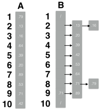

### Exercises 8.4-1
***
Using Figure 8.4 as a model, illustrate the operation of BUCKET-SORT on the array A =[.79, .13, .16, .64, .39, .20, .89, .53, .71, .42]

### `Answer`

### Exercises 8.4-2
***
What is the worst-case running time for the bucket-sort algorithm? What simple change to the algorithm preserves its linear expected running time and makes its worst-case running time O(n lg n)?

### `Answer`

当所有的item都落在一个bucket内，是最坏情况，相当于对所有数据做一次插入排序，是O(n^2)

可以用merge-sort,只是操作链表比较麻烦.

[insertion-sort-list](https://leetcode.com/problems/insertion-sort-list/)

[merge-sort-list](https://leetcode.com/problems/sort-list/)

答案可以在我的[github](https://github.com/gzc/leetcode)上找到

### Exercises 8.4-3
***
Let X be a random variable that is equal to the number of heads in two flips of a fair coin.
What is E [X^2]? What is E^2[X]?

### `Answer`
E[X^2]
= 1^2 * P(head in one flip) + 0^2 * P(tail in one flip)
= 1 * 1/2 + 0 * 1/2
= 1/2

E^2[X]
= E[X] * E[X]
= 1/2 * 1/2
= 1/4

### Exercises 8.4-4
***
We are given n point s in the unit circl e,pi =(xi,yi),such that

for i = 1, 2,...,n. Suppose that the points are uniformly distributed; that is, the probability of finding a point in any region of the circle is proportional to the area of that region. Design a Θ(n) expected-time
algorithm to sort the n points by their distances

from the origin. (Hint: Design the bucket sizes in BUCKET-SORT to reflect the uniform distribution of the points in the unit circle.)

### `Answer`
初中数学题～

就是划分n个面积相同的圆环.

[More details](http://clrs.skanev.com/08/04/04.html)

### Exercises 8.4-5
***
A probability distribution function P(x) for a random variable X is defined by P(x) = Pr {X ≤ x}. Suppose that a list of n random variables X1, X2, . . .,Xn is drawn from a continuous probability distribution function P that is computable in O(1) time. Show how to sort these numbers in linear expected time.

### `Answer`
共有n个数字，bucket的划分点i1,i2...in为P(i1) = 1/n,p(i2) = 2/n, ..., P(i_n) = (n-1)/n. 因为找出这些划分点需要n*O(1) = O(n)的时间，桶排序也是O(n)的，所以最终是O(n)的.

***
Follow [@louis1992](https://github.com/gzc) on github to help finish this task.

