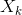

### Exercises 9.2-1
***
Show that in RANDOMIZED-SELECT, no recursive call is ever made to a 0-length array.
### `Answer`
答案很明显，假如划分的一边数组是空的，那么这个if语句条件是不会成立的，这个调用是不会被call的.

It is obvious, if the array is empty, then the condition of if will not hold, it will definitely not be called.

### Exercises 9.2-2
***
Argue that the indicator random variable  and the value T(max(k - 1, n - k)) are independent.

### `Answer`

不论取0还是1, T(max(k-1,n-k))是不会变的. 

No matter  is 0 or 1, T(max(k-1,n-k))will not change. 

### Exercises 9.2-3
***
Write an iterative version of RANDOMIZED-SELECT.

### `Answer`

[code](./exercise_code/randomized-select-iterative.cpp) tells everything!

### Exercises 9.2-4
***
Suppose we use RANDOMIZED-SELECT to select the minimum element of the array A = {3, 2, 9, 0, 7, 5, 4, 8, 6, 1}. Describe a sequence of partitions that results in a worst-case performance of RANDOMIZED-SELECT.

### `Answer`
- pivot **9** {3, 2, 0, 7, 5, 4, 8, 6, 1}
- pivot **8** {3, 2, 0, 7, 5, 4, 6, 1}
- pivot **7** {3, 2, 0, 5, 4, 6, 1}
- pivot **6** {3, 2, 0, 5, 4, 1}
- pivot **5** {3, 2, 0, 4, 1}
- pivot **4** {3, 2, 0, 1}
- pivot **3** {2, 0, 1}
- pivot **2** {0, 1}
- pivot **1** {0}
- return 0

***
Follow [@louis1992](https://github.com/gzc) on github to help finish this task.

