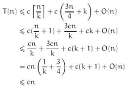
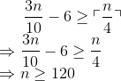
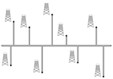

### Exercises 9.3-1
***
In the algorithm SELECT, the input elements are divided into groups of 5. Will the algorithm work in linear time if they are divided into groups of 7? Argue that SELECT does not run in linear time if groups of 3 are used.
### `Answer`
Assuming each group has k elements.

The number that less(or greater) then median of median is at least n/4-k，In the worst case, next call to SELECT will recursive call 3n/4+k elements.

so


Assuming for all n，T(n) <= cn



So according to 1/k+3/4 <= 1 wo get k >= 4

### Exercises 9.3-2
***
Analyze SELECT to show that if n ≥ 140, then at least ⌈n/4⌉ elements are greater than the median-of-medians x and at least ⌈n/4⌉ elements are less than x.

### `Answer`


### Exercises 9.3-3
***
Show how quicksort can be made to run in O() time in the worst case.

### `Answer`
比较直观，我们先利用线性时间去找到中位数，再用这个中位数去做partition.

It is obvious, we first use O(n) time to find median, then use median to do partition.


### Exercises 9.3-4
***
Suppose that an algorithm uses only comparisons to find the ith smallest element in a set of n elements. Show that it can also find the i - 1 smaller elements and the n - i larger elements without performing any additional comparisons.

### `Answer`
只用比较来确定的话，就跟这讲的方法是一样的.  我们既然找到了第i小元素，那么比i大和比i小的都已经被我们分类分好了.

We can find ith element, then the number greater than i and the number less than i have been already partitioned.

### Exercises 9.3-5
***
Suppose that you have a "black-box" worst-case linear-time median subroutine. Give a simple, linear-time algorithm that solves the selection problem for an arbitrary order statistic.

### `Answer`
[code](./exercise_code/black-box.py) tells everything. Thanks original code [here](http://clrs.skanev.com/09/03/05.html).

Find the median, and recursve half of the elements.


### Exercises 9.3-6
***
The *k*th **quantiles** of an n-element set are the *k* - 1 order statistics that divide the sorted set into *k* equal-sized sets (to within 1). Give an O(n lg k)-time algorithm to list the *k*th quantiles of a set.
### `Answer`
[code](./exercise_code/k-quantile.py) tells everything. Thanks original code [here](http://clrs.skanev.com/09/03/06.html).

- 如果k是偶数，那么取中间一个，再对左右两边进行递归.
- 如果k是奇数，取最接近中间的两个数，再对左右两边进行递归.

- If k is even, then choose the middle one, recursive call left part and right part.
- If k is odd，choose two index numbers most close to median，then recursive call the left part and right part.


### Exercises 9.3-7
***
Describe an O(n)-time algorithm that, given a set S of n distinct numbers and a positive
integer k ≤ n, determines the k numbers in S that are closest to the median of S.

### `Answer`
[code](./exercise_code/k-close2median.py)

1. 计算出中位数median
2. 将所有数减去median,再取绝对值
3. 用SELECT计算出第k小数字y
4. 遍历数组，取出所有绝对值小于等于y的

代码的局限性在于只能接收绝对值不含有相同元素的.

1. Find the median
2. For all the numbers, minus median then get the absolute value
3. use SELECT to find the kth smallest number y
4. Iterate the array choose all the absolute value that less than y

### Exercises 9.3-8
***
Let [1 .. n] and Y [1 .. n] be two arrays, each containing n numbers already in sorted order. Give an O(lg n)-time algorithm to find the median of all 2n elements in arrays X and Y.
### `Answer`
Divide and conquer

Here is a cpp code for this question.
First, we compare the mid value of each array
then we can cut down some part of this two arrays.
```cpp
// X[lo1, lo1 + n) Y[lo2, lo2 + n)
int median(int[] X, int[] Y, int lo1, int lo2, int n) {
  if (n < 3) return quickMedian(X, Y, lo1, lo2, n);
  
  int mid1 = lo1 + n / 2, mi2 = lo2 + (n - 1) / 2;
  
  if (X[mi1] < Y[mi2])
    return median(X, Y, mi1, lo2, n + lo1 - mi1);  // use X's right part and Y's left part
    
  else if (X[mi1] > Y[mi2])
    return median(X, Y, lo1, mi2, n + lo2 - mi2);  // use X's left part and Y's right part
    
  else
    return X[mi1];
```

### Exercises 9.3-9
***
Professor Olay is consulting for an oil company, which is planning a large pipeline running east to west through an oil field of n wells. From each well, a spur pipeline is to be connected directly to the main pipeline along a shortest path (either north or south), as shown in [Figure 9.2](#oil). Given x- and y-coordinates of the wells, how should the professor pick the optimal location of the main pipeline (the one that minimizes the total length of the spurs)? Show that the optimal location can be determined in linear time.



Figure 9.2: Professor Olay needs to determine the position of the east-west oil pipeline that minimizes the total length of the north-south spurs.
### `Answer`

Find the median of y.


***
Follow [@louis1992](https://github.com/gzc) on github to help finish this task.


