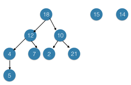

### Exercises 10.4-1
***
Draw the binary tree rooted at index 6 that is represented by the following fields.

<table class="table table-bordered table-striped table-compact">
<thead>
<tr>
<th style="text-align: center">index</th>
<th style="text-align: center">key</th>
<th style="text-align: center">left</th>
<th style="text-align: center">right</th>
</tr>
</thead>
<tbody>
<tr>
<td style="text-align: center">1</td>
<td style="text-align: center">12</td>
<td style="text-align: center">7</td>
<td style="text-align: center">3</td>
</tr>
<tr>
<td style="text-align: center">2</td>
<td style="text-align: center">15</td>
<td style="text-align: center">8</td>
<td style="text-align: center">NIL</td>
</tr>
<tr>
<td style="text-align: center">3</td>
<td style="text-align: center">4</td>
<td style="text-align: center">10</td>
<td style="text-align: center">NIL</td>
</tr>
<tr>
<td style="text-align: center">4</td>
<td style="text-align: center">10</td>
<td style="text-align: center">5</td>
<td style="text-align: center">9</td>
</tr>
<tr>
<td style="text-align: center">5</td>
<td style="text-align: center">2</td>
<td style="text-align: center">NIL</td>
<td style="text-align: center">NIL</td>
</tr>
<tr>
<td style="text-align: center">6</td>
<td style="text-align: center">18</td>
<td style="text-align: center">1</td>
<td style="text-align: center">4</td>
</tr>
<tr>
<td style="text-align: center">7</td>
<td style="text-align: center">7</td>
<td style="text-align: center">NIL</td>
<td style="text-align: center">NIL</td>
</tr>
<tr>
<td style="text-align: center">8</td>
<td style="text-align: center">14</td>
<td style="text-align: center">6</td>
<td style="text-align: center">2</td>
</tr>
<tr>
<td style="text-align: center">9</td>
<td style="text-align: center">21</td>
<td style="text-align: center">NIL</td>
<td style="text-align: center">NIL</td>
</tr>
<tr>
<td style="text-align: center">10</td>
<td style="text-align: center">5</td>
<td style="text-align: center">NIL</td>
<td style="text-align: center">NIL</td>
</tr>
</tbody>
</table>

### `Answer`

### Exercises 10.4-2
***
Write an O(n)-time recursive procedure that, given an n-node binary tree, prints out the key of each node in the tree.

### `Answer`
前序，中序和后序遍历.

### Exercises 10.4-3
***
Write an O(n)-time nonrecursive procedure that, given an n-node binary tree, prints out the key of each node in the tree. Use a stack as an auxiliary data structure.

### `Answer`

这些题目都出现在leetcode上.

[pre-order](https://leetcode.com/problems/binary-tree-preorder-traversal/) [solution](https://github.com/gzc/leetcode/blob/master/cpp/141-150/Tree%20Preorder%20Traversal.cpp)

[in-order](https://leetcode.com/problems/binary-tree-inorder-traversal/) [solution](https://github.com/gzc/leetcode/blob/master/cpp/091-100/Binary%20Tree%20Inorder%20Traversal.cpp)

[post-order](https://leetcode.com/problems/binary-tree-postorder-traversal/) [solution](https://github.com/gzc/leetcode/blob/master/cpp/141-150/Binary%20Tree%20Postorder%20Traversal.cpp)

### Exercises 10.4-4
***
Write an O(n)-time procedure that prints all the keys of an arbitrary rooted tree with n nodes, where the tree is stored using the left-child, right-sibling representation.

### `Answer`

	PROCEDURE(root):
		if root != NULL
			PRINT root->key
		if(root->child)
			PROCEDURE(root->child)
		if(root->sibling)
			PROCEDURE(root->sibling)

### Exercises 10.4-5
***
Write an O(n)-time nonrecursive procedure that, given an n-node binary tree, prints out the key of each node. Use no more than constant extra space outside of the tree itself and do not modify the tree, even temporarily, during the procedure.

### `Answer`
if we don't use stack, then we must keep new attribute `parent` in `node`. The function of parent attribute is similar as the stack which help us to find the prev node.

如果不用stack,那么每个node必须要有parent属性.stack的作用其实是依路径保存parent节点.

	PROCEDURE(root):
    	prev = NULL;

    	while root != NULL:
        	if prev == root->parent:
            	print root->key
            	root = root->left  ? root->left :
                   	   root->right ? root->right : root->parent;
        	else if prev == root->left && root->right != NULL:
            	prev = root;
            	root = root -> right;
        	else:
            	prev = root;
            	root = root -> parent;
            
see my [implementation](./exercise_code/traversal.cpp)

### Exercises 10.4-6
***
The left-child, right-sibling representation of an arbitrary rooted tree uses three pointers in each node: left-child, right-sibling, and parent. From any node, its parent can be reached and identified in constant time and all its children can be reached and identified in time linear in the number of children. Show how to use only two pointers and one boolean value in each node so that the parent of a node or all of its children can be reached and identified in time linear in the number of children.

### `Answer`
很简单,去掉parent指针,新增一个表示是否是最后一个儿子的bool值，如果是最后一个,那么next指向parent,否则next指向下一个兄弟节点.

***
Follow [@louis1992](https://github.com/gzc) on github to help finish this task.

