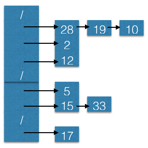

### Exercises 11.2-1
***
Suppose we use a hash function h to hash n distinct keys into an array T of length m. Assuming simple uniform hashing, what is the expected number of collisions? More precisely, what is the expected cardinality of {{k, l} : k ≠ l and h(k) = h(l)}?

### `Answer`

### Exercises 11.2-2
***
Demonstrate the insertion of the keys 5, 28, 19, 15, 20, 33, 12, 17, 10 into a hash table with collisions resolved by chaining. Let the table have 9 slots, and let the hash function be h(k) = k mod 9.

### `Answer`

### Exercises 11.2-3
***
Professor Marley hypothesizes that substantial performance gains can be obtained if we modify the chaining scheme so that each list is kept in sorted order. How does the professor's modification affect the running time for successful searches, unsuccessful searches, insertions, and deletions?

### `Answer`
* successful searches:没有影响
* unsuccessful searches:当数据量大可以加速，可以提前判断元素超出范围(如递增排序,若小于首节点,则可判断为不成功查找)
* insertions:降低了插入的速度，需要遍历链表插入在合适的位置
* deletions:没有影响

### Exercises 11.2-4
***
Suggest how storage for elements can be allocated and deallocated within the hash table itself by linking all unused slots into a free list. Assume that one slot can store a flag and either one element plus a pointer or two pointers. All dictionary and free-list operations should run in O(1) expected time. Does the free list need to be doubly linked, or does a singly linked free list suffice?

### `Answer`
需要双链表.每个slot有一个标识标识是否已分配，如果没有分配指针指向free list的属于自己的那个位置. 删除的时候将标志位清一下，将自己加入链表头，指针指向头;插入时根据指针去取.

### Exercises 11.2-5
***
Show that if |U| > nm, there is a subset of U of size n consisting of keys that all hash to the
same slot, so that the worst-case searching time for hashing with chaining is Θ(n).

### `Answer`
如果|U| ＝ nm，假设U的全集要均匀分到m个位置上，每个位置期望就有n个元素，因此至少有一个位置是有至少n个元素的，我们选取这个集合，查找操作需要的时间就是Θ(n).

***
Follow [@louis1992](https://github.com/gzc) on github to help finish this task.

