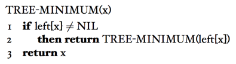
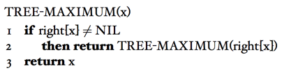
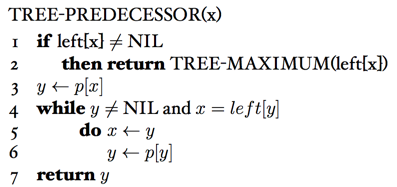

### Exercises 12.2-1
***
Suppose that we have numbers between 1 and 1000 in a binary search tree and want to search for the number 363. Which of the following sequences could not be the sequence of nodes examined?

### `Answer`
* 2, 252, 401, 398, 330, 344, 397, 363.
* 924, 220, 911, 244, 898, 258, 362, 363.
* 925, 202, 911, 240, 912, 245, 363.
* 2, 399, 387, 219, 266, 382, 381, 278, 363.
* 935, 278, 347, 621, 299, 392, 358, 363. 

***If a sequence is a binary search tree, it must have the properties of the binary search tree, so that 's the key to this problem.***
 
GROUP 3 is impossible,912 > 911
GROUP 5 is impossible,347 > 299

### Exercises 12.2-2
***
Exercises 12.2-2 Write recursive versions of the TREE-MINIMUM and TREE-MAXIMUM procedures.

### `Answer`

### Exercises 12.2-3
***
Write the TREE-PREDECESSOR procedure.

### `Answer`

### Exercises 12.2-4
***
Professor Bunyan thinks he has discovered a remarkable property of binary search trees. Suppose that the search for key k in a binary search tree ends up in a leaf. Consider three sets: A, the keys to the left of the search path; B, the keys on the search path; and C, the keys to the right of the search path. Professor Bunyan claims that any three keys a∈A, b∈B, and c∈C must satisfy a ≤ b ≤ c. Give a smallest possible counterexample to the professor’s claim.

### `Answer`

### Exercises 12.2-5
***
Show that if a node in a binary search tree has two children, then its successor has no left child and its predecessor has no right child.

### `Answer`
如果后继有左子女,那么那个左子女就是后继,所以后继不可能有左子女。同理前 继没有右子女.

If a successor has left child, then the left child should be successor. The same idea for predecessor.

### Exercises 12.2-6
***
Consider a binary search tree T whose keys are distinct. Show that if the right subtree of a node x in T is empty and x has a successor y, then y is the lowest ancestor of x whose left child is also an ancestor of x. (Recall that every node is its own ancestor.)

### `Answer`
If y is the lowest ancestor of x whose left child is also an ancestor of x, then x must be the node with the maximum key in the left subtree of y, since if we walk from y to x, we never walk left except at the first step.

### Exercises 12.2-7
***
inorder tree walk of an n-node binary search tree can be implemented by finding the minimum element in the tree with TREE-MINIMUM and then making n − 1 calls to TREE- SUCCESSOR. Prove that this algorithm runs in Θ(n)time.

### `Answer`
这个算法只遍历了每条边各两次,所以是 O(n) 的.

This algorithm traverse each edge twice, so running time is O(n).

### Exercises 12.2-8
***
Prove that no matter what node we start at in a height-h binary search
tree, k successive calls to TREE-SUCCESSOR take O(k + h) time.

### `Answer`
上一题是这题的一个实例。只需要证明访问边的次数 N ≤ (4h + 2k) ,假设 S 是开始起点,E 是结束点.

* 当S和E在同一条路径时(S是E的祖先或者E是S的祖先),结论很明显。
* 当S和E不在同一条路径时,令A为S和E的最小公共祖先。考虑节点S到 A,后继函数回溯的成本至多只有 2h(思考的时候千万不要将后继到的点的 成本算进去,那部分在 2k 里),A 到 E 的多余的成本至多也只有 2h, 其他都 是正常的回溯到的点访问边 2k.

### Exercises 12.2-9
***
Let T be a binary search tree whose keys are distinct, let x be a leaf node, and let y be its parent. Show that key[y] is either the smallest key in T larger than key[x] or the largest key in T smaller than key[x].

### `Answer`
若x是y的左叶子节点,那么x的后继是y;若x是y的右叶子节点,那么y的 后继是 x.

If x is the left leaf node of y, then succeesor of x is y; else if x is the right leaf node of x, then successor of y is x.

***
Follow [@louis1992](https://github.com/gzc) on github to help finish this task.

