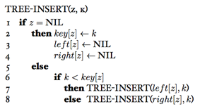
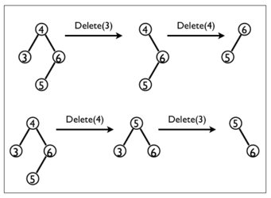

### Exercises 12.3-1
***
Give a recursive version of the TREE-INSERT procedure.

### `Answer`



### Exercises 12.3-2
***
Suppose that a binary search tree is constructed by repeatedly inserting distinct values into the tree. Argue that the number of nodes examined in searching for a value in the tree is one plus the number of nodes examined when the value was first inserted into the tree.

### `Answer`
多检查一次是否相等.

We should check one more time of this node, obviously.

### Exercises 12.3-3
***
We can sort a given set of n numbers by first building a binary search tree containing these numbers (using TREE-INSERT repeatedly to insert the numbers one by one) and then printing the numbers by an inorder tree walk. What are the worst-case and best-case running times for this sorting algorithm?

### `Answer`
退化成链表就是最坏情况.

If it's Degenerated into a list, then the worst situation.


### Exercises 12.3-4
Suppose that another data structure contains a pointer to a node y in a binary search tree, and suppose that y's predecessor z is deleted from the tree by the procedure TREE-DELETE. What problem can arise? How can TREE-DELETE be rewritten to solve this problem?
### `Answer`
当要删除的节点有两个子节点时，节点y会被删除. 如果指向的是节点y,那么就出问题的.在这种情况下应该修改成指向节点z.

If the node being deleted has two child nodes, then y will be deleted. If the pointer point to y, there will be problem. Under such situation, the pointer should point to node z.


### Exercises 12.3-5
***
Is the operation of deletion "commutative" in the sense that deleting x and then y from a binary search tree leaves the same tree as deleting y and then x? Argue why it is or give a counterexample.

### `Answer`
NO.



### Exercises 12.3-6
***
When node z in TREE-DELETE has two children, we could splice out its predecessor rather than its successor. Some have argued that a fair strategy, giving equal priority to predecessor and successor, yields better empirical performance. How might TREE-DELETE be changed to implement such a fair strategy?

### `Answer`
```
Tree-Delete(T, z)
  if z.left = NULL
     Transplant(T, z, z.right)
  else if z.right = NULL
     Transplant(T, z, z.left)
  else
     y = Tree-Maximum(z.left)
     if y.p != z
        Transplant(T, y, y.left)
        y.left = z.left
        y.left.p = y
     Transplant(T, z, y)
     y.right = z.right
     y.right.p = y
```
* Randomly choose one
* Assign each node with an attribute **height**, choose the higher one.


***
Follow [@louis1992](https://github.com/gzc) on github to help finish this task.

