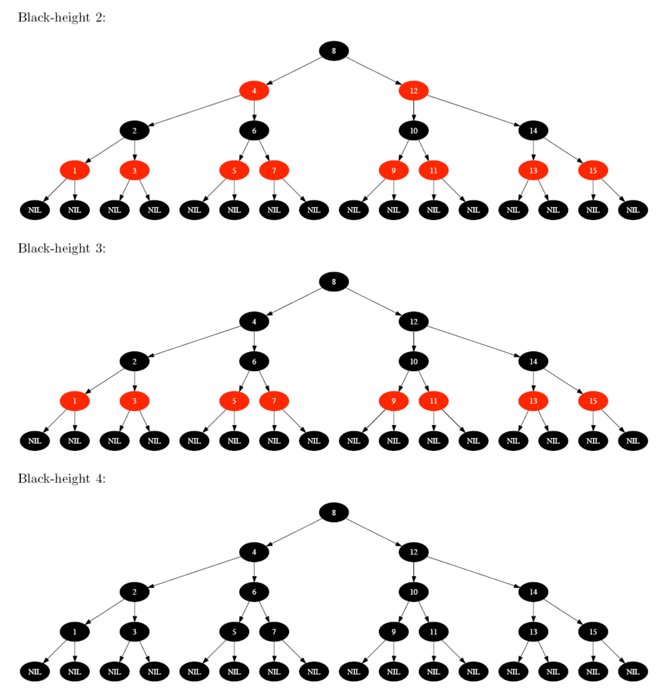
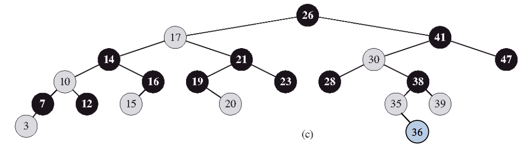
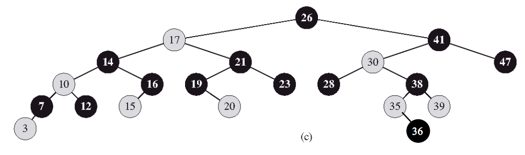

### Exercises 13.1-1
***
In the style of Figure 13.1(a), draw the complete binary search tree of height 3 on the keys {1, 2, ..., 15}. Add the NIL leaves and color the nodes in three different ways such that the black- heights of the resulting red-black trees are 2, 3, and 4.

### `Answer`
因为是一颗完全二叉树，超级平衡，所以填色很容易. 感谢[psu](http://test.scripts.psu.edu/users/d/j/djh300/cmpsc465/notes-4985903869437/solutions-to-some-homework-exercises-as-shared-with-students/3-solutions-clrs-13.pdf)提供的图片

### Exercises 13.1-2
***
Draw the red-black tree that results after TREE-INSERT is called on the tree in Figure 13.1 with key 36. If the inserted node is colored red, is the resulting tree a red-black tree? What if it is colored black?

### `Answer`
插入后如何上红色，那么违反了红节点的儿子节点是黑色这个规则.

插入后如何上黑色，那么违反了路径上包含相同黑节点数这个规则.

### Exercises 13.1-3
***
Let us define a **relaxed red-black tree** as a binary search tree that satisfies red- black properties 1, 3, 4, and 5. In other words, the root may be either red or black. Consider a relaxed red-black tree *T* whose root is red. If we color the root of *T* black but make no other changes to *T*, is the resulting tree a red-black tree?

### `Answer`
当然还是～

### Exercises 13.1-4
***
Suppose that we "absorb" every red node in a red-black tree into its black parent, so that the children of the red node become children of the black parent. (Ignore what happens to the keys.) What are the possible degrees of a black node after all its red children are absorbed? What can you say about the depths of the leaves of the resulting tree?
### `Answer`
* 2, 如果该节点的两个子结点都是黑的.
* 3, 如果仅有一个子结点是红的.
* 4, 如果两个子结点都是红的.

所有的叶子节点都有相同的高度.

### Exercises 13.1-5
***
Show that the longest simple path from a node *x* in a red-black tree to a descendant leaf has
length at most twice that of the shortest simple path from node x to a descendant leaf.
### `Answer`
根据性质5，最长和最短路径都有相同的黑节点数. 根据性质4可知路径上红节点数目不会超过黑节点，可得.

### Exercises 13.1-6
***
What is the largest possible number of internal nodes in a red-black tree with black-height *k*? What is the smallest possible number?

### `Answer`
假如有一颗完美二叉树，如果每个节点都是黑的，那么总的节点个数是
假如是一黑一红交替，那么总高度就是2k-1,总节点个数是

### Exercises 13.1-7
***
Describe a red-black tree on *n* keys that realizes the largest possible ratio of red internal nodes to black internal nodes. What is this ratio? What tree has the smallest possible ratio, and what is the ratio?

* 最大的比值是2，根节点是黑色，两个子节点是红色.
* 最小的比值是0，比如只有一个黑色的根节点.

***
Follow [@louis1992](https://github.com/gzc) on github to help finish this task.

