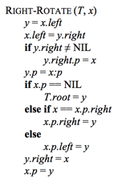

### Exercises 13.2-1
***
Write pseudocode for RIGHT-ROTATE.

### `Answer`

就模仿书上的left,right对调一下哈

### Exercises 13.2-2
***
Argue that in every n-node binary search tree, there are exactly *n - 1* possible rotations.

### `Answer`
有n个节点，就有n-1对父子节点（root节点没有）.对于每一个对，都有一个对应的旋转，所以是n-1.

You can only rotate nodes that have children. You can do either left, right, or both. If a node has 2 children, you can do 2 possible rotations. If a node has 1 child, you can only do 1 rotation. 0 children, 0 rotations. 

For example, if a tree has 3 nodes, (1 root, 2 children of root), we can rotate Left and Right for the Root, and nothing for the children. You have 2 rotations, for 3 nodes. 

If the same tree as above, but add another child onto one of the children of the root, you'd get 2 rotations for Root, and 1 rotation for the node which got the child. 4 nodes, 3 possible rotations.

We can see this follow for every addition of a new node. Thus, the amount of possible rotations is: Amount of Nodes - 1. 

### Exercises 13.2-3
***
Let a, b, and c be arbitrary nodes in subtrees α, β, and γ, respectively, in the left tree of Figure 13.2. How do the depths of a, b, and c change when a left rotation is performed on node x in the figure?

### `Answer`
图上都告诉我们了. 

* a的深度＋1
* b的深度不变
* c的深度－1

* a: +1 depth
* b: +0 depth
* c: -1 depth

If you're curious on why this is, simply draw the two situations and you can count the path-lengths. Doesn't matter which left-or-right child a, b, c is of their respective nodes.

### Exercises 13.2-4
***
Show that any arbitrary n-node binary search tree can be transformed into any other arbitrary n-node binary search tree using O(n) rotations. (Hint: First show that at most n - 1 right rotations suffice to transform the tree into a right-going chain.)
### `Answer`
思路挺有意思的. 对于根节点左边的节点，如果有右儿子就左旋;对于根节点右边的节点，如果有左儿子就右旋;最后我们得到了一根排序好的链表.

对于另外一棵树，我们也能通过相同的方法转换为这根链表.

因此，通过逆变换就能转换回去，自然是O(n)的.

### Exercises 13.2-5 ⋆
***
We say that a binary search tree T1 can be right-converted to binary search tree T2 if it is possible to obtain T2 from T1 via a series of calls to **RIGHT-ROTATE**. Give an example of two trees T1 and T2 such that T1 cannot be right-converted to T2. Then show that if a tree T1 can be right-converted to T2, it can be right-converted using O(n^2) calls to RIGHT-ROTATE.
### `Answer`
反例很好举，T1(1,#,2),T2(2,1,#),T1无法右旋成T2.

O(n^2)是这样来的. 如果T1和T2的根节点不同，那么可以通过O(n)次右旋将T1的根节点变成T2的根节点. 接下来递归调用root的右节点. 可以得到T(n) = T(n-1) + O(n). 所以是O(n^2).

***
Follow [@louis1992](https://github.com/gzc) on github to help finish this task.

