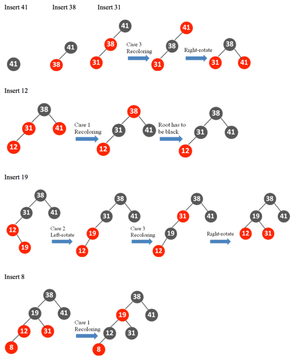
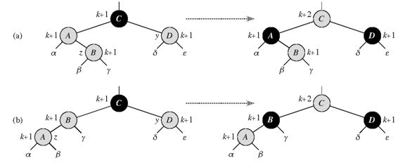
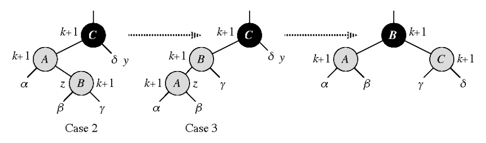

### Exercises 13.3-1
***
In line 16 of RB-INSERT, we set the color of the newly inserted node z to red. Notice that if we had chosen to set z's color to black, then property 4 of a red-black tree would not be violated. Why didn't we choose to set z's color to black?

### `Answer`
性质5会被破坏，黑节点多出来了.

### Exercises 13.3-2
***
Show the red-black trees that result after successively inserting the keys 41, 38, 31, 12, 19, 8 into an initially empty red-black tree.

### `Answer`
盗图感谢[psu](http://test.scripts.psu.edu/users/d/j/djh300/cmpsc465/notes-4985903869437/solutions-to-some-homework-exercises-as-shared-with-students/3-solutions-clrs-13.pdf)

### Exercises 13.3-3
***
Suppose that the black-height of each of the subtrees α, β, γ, δ, ε in Figures 13.5 and 13.6 is k. Label each node in each figure with its black-height to verify that property 5 is preserved by the indicated transformation.

### `Answer`

### Exercises 13.3-4
***
Professor Teach is concerned that RB-INSERT-FIXUP might set color[nil[T]] to RED, in which case the test in line 1 would not cause the loop to terminate when z is the root. Show that the professor's concern is unfounded by arguing that RB-INSERT-FIXUP never sets color[nil[T]] to RED.
### `Answer`

这是RB-INSERT-FIXUP的伪代码.只有第7行和第13行会修改颜色.

在第7行这个分支，z.p是红的，因为根不可能为红所以z.p.p肯定不是nil,所以这一行不会设置color[nil[T]]. 同理对于13行也是如此.

### Exercises 13.3-5
***
Consider a red-black tree formed by inserting n nodes with RB-INSERT. Argue that if n > 1, the tree has at least one red node.
### `Answer`
观察RB-INSERT-FIXUP的伪代码，一个分支会减少一个红节点，另一个分支则不变. 当n=2时，红节点 ＝ 黑节点 ＝ 1. 之后每次调用RB-INSERT时会插入一个红节点再调用RB-INSERT-FIXUP,如果为情况2或情况3红节点数不会减少. 而对于情况1，必有新插入的结点为红色结点。所以n>2时红色结点个数至少一个

### Exercises 13.3-6
***
Suggest how to implement RB-INSERT efficiently if the representation for red-black trees includes no storage for parent pointers.
### `Answer`
用一个hash table去保存 =.=

或者每次插入的时候维护一个stack,这样实现起来也比较麻烦.

***
Follow [@louis1992](https://github.com/gzc) on github to help finish this task.

