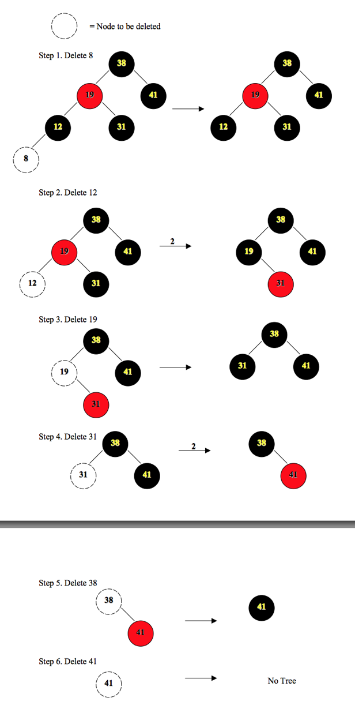
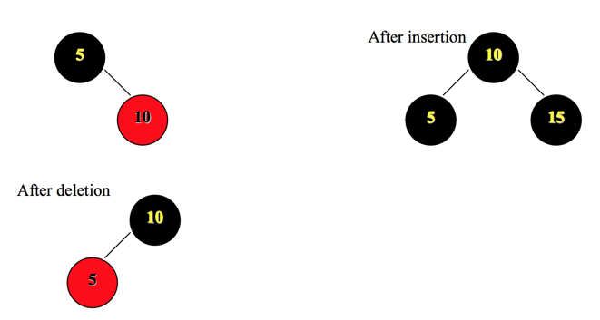

### Exercises 13.4-1
***
Argue that after executing RB-DELETE-FIXUP, the root of the tree must be black.

### `Answer`
我们来看4种情况吧.

1. case1会被转化为case2,3,4.
2. 如果case1转变成case2退出的时候，会设置color[x] = BLACK. 否则，会继续往上递归.
3. case3会被转化成case4.
4. case4会将x置为root,循环条件不成立，color[x] = BLACK

因此，root总是黑的.

### Exercises 13.4-2
***
Argue that if in RB-DELETE both x and p[y] are red, then property 4 is restored by the call
RB-DELETE-FIXUP(T, x).

### `Answer`
因为color[x] = RED,不会进入循环,第23行会直接设置color[x] = BLACK.

### Exercises 13.4-3
***
In Exercise 13.3-2, you found the red-black tree that results from successively inserting the keys 41, 38, 31, 12, 19, 8 into an initially empty tree. Now show the red-black trees that result from the successive deletion of the keys in the order 8, 12, 19, 31, 38, 41.

### `Answer`
Thanks [uta](http://ranger.uta.edu/~weems/NOTES2320/HWANS/hw2ansold.pdf) for the picture.

### Exercises 13.4-4
***
In which lines of the code for RB-DELETE-FIXUP might we examine or modify the sentinel
nil[T]?
### `Answer`

如果y没有孩子，那么x为哨兵nil[T].

只有第2行会检测.

### Exercises 13.4-5
***
In each of the cases of Figure 13.7, give the count of black nodes from the root of the subtree shown to each of the subtrees α, β, ..., ζ, and verify that each count remains the same after the transformation. When a node has a color attribute c or c′, use the notation count(c) or count(c′) symbolically in your count.
### `Answer`
看着4个case慢慢数 ＝ ＝

### Exercises 13.4-6
***
Professors Skelton and Baron are concerned that at the start of case 1 of RB- DELETE-FIXUP, the node x:p might not be black. If the professors are correct, then lines 5–6 are wrong. Show that x:p must be black at the start of case 1, so that the professors have nothing to worry about.
### `Answer`
如果p(x)是红色的，那么w不可能是红色的，第4行就不会成立.

### Exercises 13.4-7
***
Suppose that a node x is inserted into a red-black tree with RB-INSERT and then immediately deleted with RB-DELETE. Is the resulting red-black tree the same as the initial red-black tree? Justify your answer.

### `Answer`
不一定. thanks [uta](http://ranger.uta.edu/~weems/NOTES2320/HWANS/hw2ansold.pdf) for the picture.

***
Follow [@louis1992](https://github.com/gzc) on github to help finish this task.

