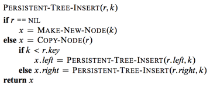
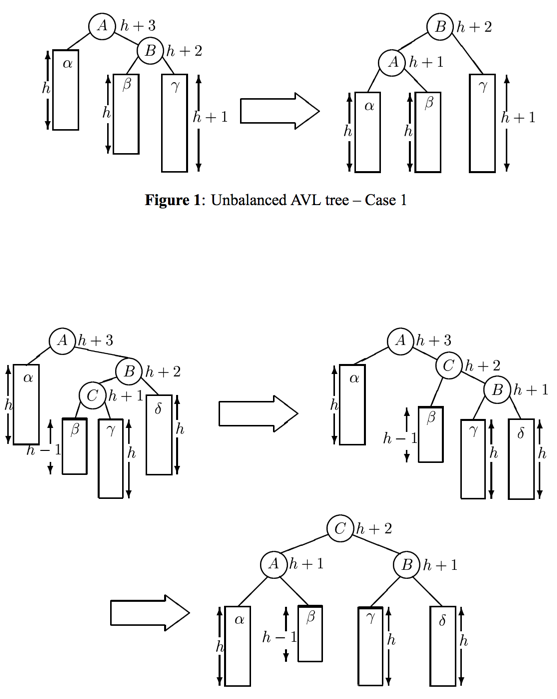
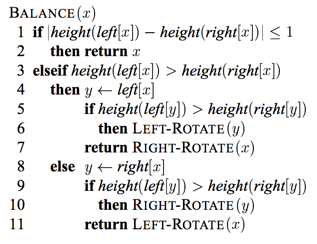
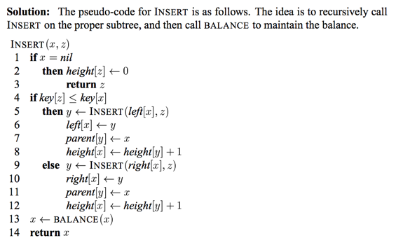
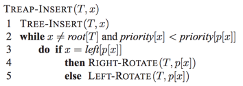

### Problems 1 : Persistent dynamic sets
***

a. For a general persistent binary search tree, identify the nodes that need to be changed to insert a key k or delete a node y.

b. Write a procedure PERSISTENT-TREE-INSERT that, given a persistent tree T and a key k to insert, returns a new persistent tree T′ that is the result of inserting k into T.

c. If the height of the persistent binary search tree T is h, what are the time and space requirements of your implementation of PERSISTENT-TREE-INSERT? (The space requirement is proportional to the number of new nodes allocated.)

d. Suppose that we had included the parent field in each node. In this case, PERSISTENT-TREE-INSERT would need to perform additional copying. Prove that PERSISTENT-TREE-INSERT would then require Ω(n) time and space, where n is the number of nodes in the tree.

e. Show how to use red-black trees to guarantee that the worst-case running time and space are O(lg n) per insertion or deletion.

### `Answer`
a. 插入的时候，需要改变根节点到这个叶子节点路径上的所有节点. BST删除有3种情况，如果删除的是根节点，那么需要改变根节点到这个叶子节点路径上的所有节点; 如果删除的节点只有一个子节点，那么需要改变根节点到这个删除节点路径之间的所有节点; 如果删除的节点有两个子节点，那么也是需要修改被影响的路径.只有一条路径被影响，因为某个节点和其后继肯定是同一条路径的.

b. 先定义两个操作. MAKE-NEW-NODE(k) 创建一个键值为k的新节点,左儿子和右儿子默认为NIL,并返回这个节点;COPY-NODE(x) 创建一个和x一模一样的节点并返回.
r是根节点

c. O(h)的时间和空间

d. 很好理解，因为根节点变了，所以子节点要指向新的节点，必然也要创建新的子节点.

e. 首先要认识到最重要的两点. 1. 根据d可知节点不能有parent属性，因此我们在RB-INSERT的时候需要用stack去保存从根到叶子节点，然后将这个stack作为参数传到RB-INSERT-FIXUP或者RB-DELETE. 2. 旋转或重新着色不会改变超过O(lgn)的节点.   
INSERT : 首先和BST一样，最后插入了红节点. 有3种case,第一种节点z上升两层，修改了z的父亲节点(INSERT的时候已经创建)，爷爷节点(INSERT的时候已经创建)和叔父节点(调用COPY-NODE创建并修改颜色),所以这种情况只创建了一个新节点和修改3次颜色. 而case2和case3执行后是不会再次循环的，最多旋转两次. case2和case3只对6个节点进行操作，而且这6个节点都已经创建出来，只是简单的修改指针和颜色.    
DELETE : 4个case,只有case2会进入循环，最多会执行3次rotation结束. case1会创建新节点D;case2也会创建新节点D,然后节点x往上移动一层;case3会创建新节点C和D;case4会创建新节点D和E(注意，不一定会创建，如果一个case是从其他来的有些节点就已经创建好了).

### Problems 2 : Join operation on red-black trees
***
a. Given a red-black tree T, we store its black-height as the field bh[T]. Argue that this field can be maintained by RB-INSERT and RB-DELETE without requiring extra storage in the nodes of the tree and without increasing the asymptotic running times. Show that while descending through T, we can determine the black-height of each node we visit in O(1) time per node visited.

b. Assume that bh[T1] ≥ bh[T2]. Describe an O(lg n)-time algorithm that finds a black node y in T1 with the largest key from among those nodes whose black-height is bh[T2].

c. Let Ty be the subtree rooted at y. Describe how 

can replace  in O(1) time without destroying the binary-search-tree property.

d. What color should we make x so that red-black properties 1, 3, and 5 are maintained? Describe how properties 2 and 4 can be enforced in O(lg n) time.

e. Argue that no generality is lost by making the assumption in part (b). Describe the symmetric situation that arises when bh[T1] = bh[T2].

f. Argue that the running time of RB-JOIN is O(lg n).

### `Answer`
a. 在insert时，如果迭代回到根节点并修改了颜色，那么黑高度就＋1;在delete时，如果迭代回到根节点，那么黑高度就－1;当T沿高度下降时，每遇到一个黑节点就将黑高度－1，自然是O(1)的.

b. 从T1往下迭代，有右节点就走右节点;碰到黑节点黑高度就－1，一直到黑高度为bh[T2].

c. 构造子树以x为根，左儿子是右儿子是,将x挂到y的父节点下面,并将x设为RED(保持性质5).

d. RED.当y的父节点是红色时需要调整，根INSERT-FIXUP的case1类似，是O(lgn).

e. 情况反一下而已～

f. 根据前面的分析，是log(n)的.

### Problems 3 : AVL trees
***
An **AVL tree** is a binary search tree that is **height balanced**: for each node x, the heights of the left and right subtrees of x differ by at most 1. To implement an AVL tree, we maintain an extra field in each node: h[x] is the height of node x. As for any other binary search tree T, we assume that root[T] points to the root node.

a. Prove that an AVL tree with n nodes has height O(lg n). (Hint: Prove that in an AVL tree of height h, there are at least Fh nodes, where Fh is the hth Fibonacci number.)

b. To insert into an AVL tree, a node is first placed in the appropriate place in binary
search tree order. After this insertion, the tree may no longer be height balanced. Specifically, the heights of the left and right children of some node may differ by 2. Describe a procedure BALANCE(x), which takes a subtree rooted at x whose left and right children are height balanced and have heights that differ by at most 2, i.e., |h[right[x]] - h[left[x]]| ≤ 2, and alters the subtree rooted at x to be height balanced. (Hint: Use rotations.)

c. Using part (b), describe a recursive procedure AVL-INSERT(x, z), which takes a node x within an AVL tree and a newly created node z (whose key has already been filled in), and adds z to the subtree rooted at x, maintaining the property that x is the root of an AVL tree. As in TREE-INSERT from Section 12.3, assume that key[z] has already been filled in and that left[z] = NIL and right[z] = NIL; also assume that h[z] = 0. Thus, to insert the node z into the AVL tree T, we call AVL-INSERT(root[T], z).

d. Show that AVL-INSERT,run on an n-node AVL tree,takes O(lgn) time and performs O(1) rotations.

### `Answer`
a. 对于斐波那契数列有F(0) = 1, F(1) = 1, F(2) = 2,...,F(n) = F(n-1)+F(n-2).  
设T(n)为高度h的AVL树的最少节点数. 我们尝试证明 \\ge%20F\(n\)) .  
一开始，有\\ge%20F\(1\)) 和\\ge%20F\(2\))  
\\ge%20T\(n-1\)%20+%20T\(n-2\)%20+%201%20\\\\%20%20~\\hspace{15%20mm}%20\\ge%20F\(n-1\)%20+%20F\(n-2\)%20+%201%20\\\\%20~\\hspace{15%20mm}%0d%0a%20\>%20F\(n\)%20%0d%0a) 
 
并且有%20\\le%201.6^n),
因此%20=%20O\(%20%20\\lg\(n\)%20%20%20\)%20).

b. 	thanks [mit](http://courses.csail.mit.edu/6.046/spring04/handouts/ps5-sol.pdf) for this picture. 只画出了右边大于左边的情况.

c. 
 

d. 因为AVL树的高度是lg(h),所以AVL-INSERT需要P(lgn)的时间.因为BALANCE操作会将不平衡的子树的高度减掉1，所以不会影响到其他地方.

### Problems 4 : Treaps
***
a. Show that given a set of nodes x1, x2, ..., xn, with associated keys and priorities (all distinct), there is a unique treap associated with these nodes.

b. Show that the expected height of a treap is Θ(lg n), and hence the time to search for a value in the treap is Θ(lg n).

c. Explain how TREAP-INSERT works. Explain the idea in English and give pseudocode. (Hint: Execute the usual binary-search-tree insertion procedure and then perform rotations to restore the min-heap order property.)

d. Show that the expected running time of TREAP-INSERT is Θ(lg n).

e. Consider the treap T immediately after x is inserted using TREAP-INSERT. Let C be the length of the right spine of the left subtree of x. Let D be the length of the left spine of the right subtree of x. Prove that the total number of rotations that were performed during the insertion of x is equal to C + D.

### `Answer`

a. Treap会将结点以它们的优先级的顺序插入一颗正常的二叉树. 假如n-1个节点的Treap是确定的，因为INSERT算法是确定性算法，可以得到n个节点的Treap也是确定的.

b. 采取随机分配优先级的方法和随机构造的BST是等价的，因此是O(lg n)的.

c.  

d. 比较明显就不证明了.

e. 每一次旋转, C+D都会增加1;画张图出来会很明显的.

这题剩下的[答案](http://www2.myoops.org/twocw/mit/NR/rdonlyres/Electrical-Engineering-and-Computer-Science/6-046JFall-2005/760259F8-457D-4895-AFDC-8CE9C73D18A5/0/ps4sol.pdf)

***
Follow [@louis1992](https://github.com/gzc) on github to help finish this task
