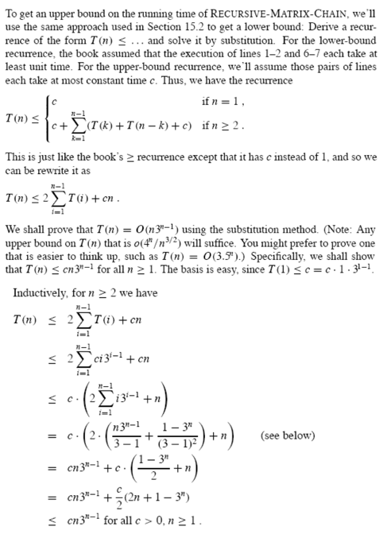

### Exercises 15.3-1
***
Which is a more efficient way to determine the optimal number of multiplications in a matrix- chain multiplication problem: enumerating all the ways of parenthesizing the product and computing the number of multiplications for each, or running RECURSIVE-MATRIX- CHAIN? Justify your answer.

### `Answer`
15.2节给出枚举方法的时间复杂度为
)

The following are copied from solutions made by others, sorry I do not have author's name/

对于RECURSIVE-MATRIX- CHAIN

### Exercises 15.3-2
***
Draw the recursion tree for the MERGE-SORT procedure from Section 2.3.1 on an array of 16 elements. Explain why memoization is ineffective in speeding up a good divide-and- conquer algorithm such as MERGE-SORT.

### `Answer`
因为并没有重叠子问题,只能用并行去优化.

### Exercises 15.3-3
***
Consider a variant of the matrix-chain multiplication problem in which the goal is to parenthesize the sequence of matrices so as to maximize, rather than minimize, the number of scalar multiplications. Does this problem exhibit optimal substructure?

### `Answer`
是的.

### Exercises 15.3-4
***
Describe how assembly-line scheduling has overlapping subproblems.

### `Answer`
我们要求解到达S1,j最快路线,必须先知道到达S1,j-1和S2,j-1的最快路线.这就是重叠子问题.
			
### Exercises 15.3-5
***
As stated, in dynamic programming we first solve the subproblems and then choose which of them to use in an optimal solution to the problem. Professor Capulet claims that it is not always necessary to solve all the subproblems in order to find an optimal solution. She suggests that an optimal solution to the matrix-chain multiplication problem can be found by always choosing the matrix Ak at which to split the subproduct Ai Ai+1 Aj (by selecting k to minimize the quantity pi-1 pk pj) before solving the subproblems. Find an instance of the matrix-chain multiplication problem for which this greedy approach yields a suboptimal solution.

### `Answer`
此处求解时用了贪心策略, 每次选取矩阵Ak分裂时,使得pi-1pkpi最小.

### Exercises 15.3-6
***
Imagine that you wish to exchange one currency for another. You realize that
instead of directly exchanging one currency for another, you might be better off
making a series of trades through other currencies, winding up with the currency
you want. Suppose that you can trade n different currencies, numbered 1,2, ... , n,
where you start with currency 1 and wish to wind up with currency n. You are
given, for each pair of currencies i and j , an exchange rate rij , meaning that if
you start with d units of currency i , you can trade for drij units of currency j .
A sequence of trades may entail a commission, which depends on the number of
trades you make. Let ck be the commission that you are charged when you make k
trades. Show that, if ck = 0 for all k = 1,2, ... , n, then the problem of finding the
best sequence of exchanges from currency 1 to currency n exhibits optimal substructure.
Then show that if commissions ck are arbitrary values, then the problem
of finding the best sequence of exchanges from currency 1 to currency n does not
necessarily exhibit optimal substructure.

### `Answer`
let v[1...n] be an array representing the best value of exchanged currency. 
Then v[i] = d, if i = 1 
and         max(v[k] * r[k][i]) where 1 <= k < i, if i > 2 

if c[k] = 0, for all k = 1, 2 ... n 
As is shown in the recursion, the solution to the main problem combines the optimal solutions to subproblems. The solution of the main problem is also optimal. Therefore, the problem exhibits the optimal substructure. 

if c[k] is arbitrary, then the problem does not necessarily exhibit the optimal substructure because there is not guarantee that the subproblems give optimal solutions.

***
Follow [@louis1992](https://github.com/gzc) on github to help finish this task.

