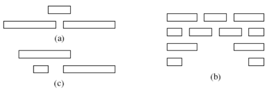

### Exercises 16.1-1
***
Give a dynamic-programming algorithm for the activity-selection problem, based on the recurrence (16.3). Have your algorithm compute the sizes c[i, j] as defined above and also produce the maximum-size subset A of activities. Assume that the inputs have been sorted as in equation (16.1). Compare the running time of your solution to the running time of GREEDY-ACTIVITY-SELECTOR.

### `Answer`
动态规划时间复杂度为O(n^3),贪心算法时间复杂度为O(n).

	DYNAMIC_ACTIVITY_SELECTOR(S):
		initialize c[i,j] = 0
		for i <- 1 to n
			do for j <- 2 to n
				do if i >= j
					then c[i,j] <- 0
				else
					for k <- i+1 to j-1
						do if c[i,j] < c[i,k] + c[k,j] + 1
							then c[i,j] <- c[i,k] + c[k,j] + 1
								s[i,j] <- k

### Exercises 16.1-2
***
Suppose that instead of always selecting the first activity to finish, we instead select the last activity to start that is compatible with all previously selected activities. Describe how this approach is a greedy algorithm, and prove that it yields an optimal solution.

### `Answer`

最迟开始和最先结束其实是同样的思想.

	GREEDY-ACTIVITY-SELECTOR(s,f)
		n <- length[s]
		A <- {an}
		i <- n
		for m <- n-1 to 1
			do if fm <= si
				then A <- A U {am}
					i <- m
		return A

### Exercises 16.1-3
***
Suppose that we have a set of activities to schedule among a large number of lecture halls. We wish to schedule all the activities using as few lecture halls as possible. Give an efficient greedy algorithm to determine which activity should use which lecture hall.

(This is also known as the **interval-graph coloring problem**. We can create an interval graph whose vertices are the given activities and whose edges connect incompatible activities. The smallest number of colors required to color every vertex so that no two adjacent vertices are given the same color corresponds to finding the fewest lecture halls needed to schedule all of the given activities.)

### `Answer`
Find the smallest number of lectures halls to schedule a set of activities S in.To do this efficiently move throught the activities according to starting and finishing times. Maintain two lists of lecture halls: Halls that are busy at time t and halls that are free at time t. When t is the starting time for some activity schedule this activity to a free lecture hall and move the hall to the busy list. Similarly, move the hall to the free list when the activity stops. Initially start with zero halls. If there are no halls in the free list create a new hall.

The above algorithm uses the fewest number of halls possible : Assume the algorithm used m halls. Consider some activity a that was the first scheduled activity in lecture hall m. i was put in the mth hall because all of the m-1 halls were busy, that is, at the time a is scheduled there are m activities occurring simultaneously. Any algorithm must therefore use at least m halls, and the algorithm is thus optimal.

The algorithm can be implemented by sorting the activities. At each start or finish time we can schedule the activities and move the halls between the lists in constant time. The total time is thus dominated by sorting and is therefore O(nlgn).
				

### Exercises 16.1-4
***
Not just any greedy approach to the activity-selection problem produces a maximum-size set of mutually compatible activities. Give an example to show that the approach of selecting the activity of least duration from those that are compatible with previously selected activities does not work. Do the same for the approaches of always selecting the compatible activity that overlaps the fewest other remaining activities and always selecting the compatible remaining activity with the earliest start time.

### `Answer`
Show that selecting the activity with the least duration or with minimum overlap or earliest starting time does not yield an optimal solution for the activity-selection problem. Consider the figure below

Selecting the activity with the least duration from example a will result in selecting the topmost activity and none other. Clearly, this is worse than the optimal solution obtained by selecting the two activities in the second row.

The activity with the minimum overlap in example b is the middle activity in the top row. However, selecting this activity eliminates the possibility of selecting the optimal solution depicted in the second row.

Selecting the activity with the earliest starting time in example c will yield only the one activity in the top row.

***
Follow [@louis1992](https://github.com/gzc) on github to help finish this task.

