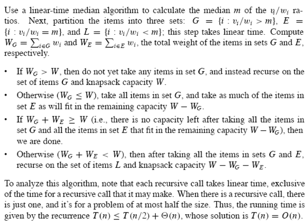
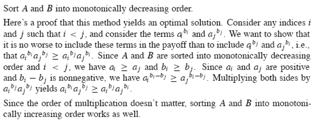

### Exercises 16.2-1
***
Prove that the fractional knapsack problem has the greedy-choice property.

### `Answer`
Thm. The fractional knapsack problem has the greedy-choice property.  
Proof:  
We need to show that we can construct a global optimal solution from local optimal solutions. 
To show that is to show if every time we pick out the commodity with the greatest value per pound, we will finally obtain the optimal value of all commodities under limit W. 
Consider an non-empty set S, and let Cm be the commodity with the greatest value (v[m]/w[m]) per pound in S. Let A be a subset of S such that A has the greatest value under limit W and let Cj be the commodity with the greatest value (v[j]/w[j]) per pound in A. To prove the thm, we need to show, Cm must be in the subset A. 
By picking out Cm, we will encounter two cases: 
case1: w[m] >= W 
In this case, the knapsack is full. Because Cm is the the commodity with the greatest value (v[m]/w[m]) per pound, W * (v[m]/w[m]) must be the greatest value for all W * (v[i]/w[i]), where 1 <= i <= n. Thm is already proved. 
case2: w[m] < W 
In this case, we know for sure that for weight w[m], v[m] is the greatest value this amount commodities can bring.  
If Cm = Cj, then the thm is proved. 
If Cm != Cj, then to reach v[m], the weight needed from Cj must be more than w[m] because v[m] is, as shown, the greates value for weight w[m]. That is, if we replace Cm with Cj in A, the value of knapsack actually decreases. Contradiction to the original solution being optimal.

### Exercises 16.2-2
***
Give a dynamic-programming solution to the 0–1 knapsack problem that runs in O(n W) time, where n is number of items and W is the maximum weight of items that the thief can put in his knapsack.

### `Answer`

	DYNAMIC-0-1-KNAPSACK(v,w,n,W)
		for w <- 0 to W do
			c[0,w] <- 0
		end for
		for i <- 1 to n do
			c[i,0] <- 0
			for w <- 1 to W do
				if wi <= w then
					if vi+c[i-1,w-wi] > c[i-1,w] then
						c[i,w] <- vi + c[i-1,w-wi]
					else
						c[i,w] <- c[i-1,w]
					end if
				else
					c[i,w] <- c[i-1,w]
				end if
			end for
		end for
		return c[n,W]

### Exercises 16.2-3
***
Suppose that in a 0–1 knapsack problem, the order of the items when sorted by increasing weight is the same as their order when sorted by decreasing value. Give an efficient algorithm to find an optimal solution to this variant of the knapsack problem, and argue that your algorithm is correct.

### `Answer`
最轻的先装,时间主要是排序的时间.

### Exercises 16.2-4
***
Professor Midas drives an automobile from Newark to Reno along Interstate 80. His car's gas tank, when full, holds enough gas to travel n miles, and his map gives the distances between gas stations on his route. The professor wishes to make as few gas stops as possible along the way. Give an efficient method by which Professor Midas can determine at which gas stations he should stop, and prove that your strategy yields an optimal solution.

### `Answer`
The optimal strategy is the obvious greedy one. Starting with a full tank of gas, Professor Midas should go to the farthest gas station he can get to within n miles of Network. Fill up there. Then go to the farthest gas station he can get to within n miles of where he filled up, and fill up there, and so on.

### Exercises 16.2-5
***
Describe an efficient algorithm that, given a set {x1, x2, ...,xn} of points on the real line, determines the smallest set of unit-length closed intervals that contains all of the given points. Argue that your algorithm is correct.

### `Answer`
Consider the following very simple algorithm: Sort the points obtaining a new array {y1,...,yn}. The first interval is given by[y1,y1+1]. If yi is the leftmost point not contained in any existing interval the next interval is [yi,yi+1] and so on.

Thie greedy algorithm does the job since the rightmost element of the set must be contained in an interval and we can do no better than the interval [y1,y1+1]. Additionally, any subproblem to the optimal solution must be optimal. This is easily seen by considering the problem for the points greater than y1+1 and arguing inductively.

### Exercises 16.2-6 *
***
Show how to solve the fractional knapsack problem in O(n) time. Assume that you have a
solution to Problem 9-2.

### `Answer`

### Exercises 16.2-7
***
Suppose you are given two sets A and B, each containing n positive integers. You can choose to reorder each set however you like. After reordering, let ai be the ith element of set A, and let bi be the ith element of set B. You then receive a payoff of . 
Give an algorithm that will maximize your payoff. Prove that your algorithm maximizes the payoff, and state its running time.

### `Answer`

***
Follow [@louis1992](https://github.com/gzc) on github to help finish this task.

