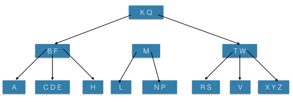
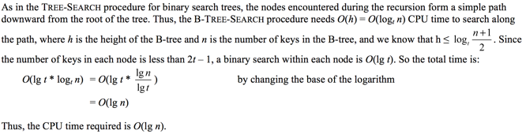

### Exercises 18.2-1
***
Show the results of inserting the keys

F, S, Q, K, C, L, H, T, V, W, M, R, N, P, A, B, X, Y, D, Z, E

in order into an empty B-tree with minimum degree 2. Only draw the configurations of the tree just before some node must split, and also draw the final configuration.

### `Answer`

### Exercises 18.2-2
***
Explain under what circumstances, if any, redundant DISK-READ or DISK-WRITE operations are performed during the course of executing a call to B-TREE-INSERT. (A redundant DISK-READ is a DISK-READ for a page that is already in memory. A redundant DISK-WRITE writes to disk a page of information that is identical to what is already stored there.)

### `Answer`
In order to insert the key into a full child node but without its parent being full, we need the following operations:

* DISK-READ: Key placement
* DISK-WRITE: Split nodes
* DISK-READ: Get to the parent
* DISK-WRITE: Fill parent

If both were full, we'd have to do the same, but instead of the final step, repeat the above to split the parent node and write into the child nodes. With both considerations in mind, there should never be a redundant DISK-READ or DISK-WRITE on a B-TREE-INSERT. 

### Exercises 18.2-3
***
Explain how to find the minimum key stored in a B-tree and how to find the predecessor of a given key stored in a B-tree.

### `Answer`
Finding the minimum in a B-tree is quite similar to finding a minimum in a binary search tree. We need to find the left most leaf for the given root, and return the first key.

Finding the predecessor of a given key x.keyi is according to the following rules:

* If x is not a leaf, return the maximum key in the i-th child of x, which is also the maximum key of the subtree rooted
at x.ci
* If x is a leaf and i > 1, return the (i–1)st key of x, i.e., x.keyi–1
* Otherwise, look for the last node y (from the bottom up) and j > 0, such that x.keyi is the leftmost key in y.cj; if j = 1, return NIL since x.keyi is the minimum key in the tree; otherwise we return y.keyj–1. 

[implementation](./btree.cpp)

### Exercises 18.2-4 *
***
Suppose that the keys {1, 2, ..., n} are inserted into an empty B-tree with minimum degree 2. How many nodes does the final B-tree have?

### `Answer`
I find the answer `n - 2lg(n+1)` in the Internet, but don't know why.

n | node
:----:|:----:
1 | 1
2 | 1
3 | 1
4 | 3
5 | 3
6 | 4
7 | 4
8 | 5
9 | 7
10 | 8

### Exercises 18.2-5
***
Since leaf nodes require no pointers to children, they could conceivably use a different (larger) t value than internal nodes for the same disk page size. Show how to modify the procedures for creating and inserting into a B-tree to handle this variation.

### `Answer`
we could set the new t(name it t') value of leaf node = 1.5t.  

### Exercises 18.2-6
***
Since leaf nodes require no pointers to children, they could conceivably use a different (larger) t value than internal nodes for the same disk page size. Show how to modify the procedures for creating and inserting into a B-tree to handle this variation.

### `Answer`

### Exercises 18.2-7
***
Suppose that disk hardware allows us to choose the size of a disk page arbitrarily, but that the time it takes to read the disk page is a + bt, where a and b are specified constants and t is the minimum degree for a B-tree using pages of the selected size. Describe how to choose t so as to minimize (approximately) the B-tree search time. Suggest an optimal value of t for the case in which a = 5 milliseconds and b = 10 microseconds.

### `Answer`
Objective : minimize (5+10t)*tlog{t}{n}

***
Follow [@louis1992](https://github.com/gzc) on github to help finish this task.

