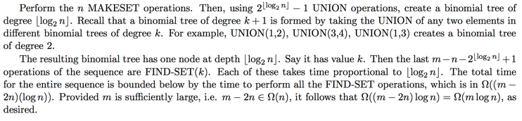

### Exercises 21.3-1
***
Do Exercise 21.2-2 using a disjoint-set forest with union by rank and path compression.

### `Answer`

<pre>
					1
				
			/		|	\	   				\	
			2		3    5					9
			
					|	/ \			/    /		 \
					4   6 7		   10   11		 13
					
						  |				 |	   /   \
	   					  8  			12    14   15
	   					  
	   					  						    |
	   					  						    16
</pre>

### Exercises 21.3-2
***
Write a nonrecursive version of FIND-SET with path compression.

### `Answer`
[implementation](./uf.cpp)

### Exercises 21.3-3
***
Give a sequence of m MAKE-SET, UNION, and FIND-SET operations, n of which are MAKE-SET operations, that takes Ω(m lg n) time when we use union by rank only.

### `Answer`
[reference](http://www.cs.toronto.edu/~avner/teaching/263/A/4sol.pdf)

### Exercises 21.3-4 *
***
Show that any sequence of m MAKE-SET, FIND-SET, and LINK operations, where all the LINK operations appear before any of the FIND-SET operations, takes only O(m) time if both path compression and union by rank are used. What happens in the same situation if only the path-compression heuristic is used?

### `Answer`
In addition to each tree, we’ll store a linked list (whose set object contains a single tail pointer) with which keeps track of all the names of elements in the tree.  The only additional information we’ll store in each node is a pointer `x.l` to that element’s position in the list.  When we call MAKE-SET(x), we’ll also create a new linked list, insert the label of x into the list, and set `x.l` to a pointer to that label. This is all done in `O(1)`. FIND-SET will remain unchanged. UNION(x,y) will work as usual, with the additional requirement that we union the linked lists of x and y. Since we don’t need to update pointers to the head, we can link up the lists in constant time, thus preserving the runtime of UNION. Finally, PRINT-SET(x) works as follows:  first,  set s = FIND-SET(x).  Then print  the  elements  in  the  linked  list,  starting  with  the  element  pointed  to  by x. (This will be the first element in the list).  Since the list contains the same number  of  elements  as  the  set  and  printing  takes `O(1)`, this operation  takes linear time in the number of set members.

***
Follow [@louis1992](https://github.com/gzc) on github to help finish this task.

