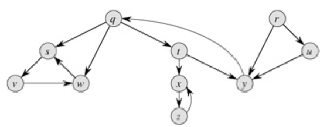
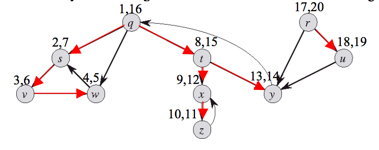
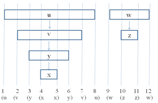
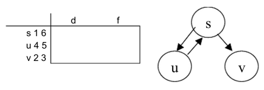

### Exercises 22.3-1
Make a 3-by-3 chart with row and column labels WHITE, GRAY, and BLACK. In each cell (i, j), indicate whether, at any point during a depth-first search of a directed graph, there can be an edge from a vertex of color i to a vertex of color j. For each possible edge, indicate what edge types it can be. Make a second such chart for depth-first search of an undirected graph.

### `Answer`

Directed

(i,j) | White | Gray | Black
:----:|:----:|:----:|:----:
White | TBFC | BC | C
Gray | TF | TFB | TFC
Black |    |  B | TFBC

Undirected

(i,j) | White | Gray | Black
:----:|:----:|:----:|:----:
White | TB | TB |
Gray | TB | TB | TB
Black |    |  TB | TB

### Exercises 22.3-2
***
Show how depth-first search works on the graph of Figure 22.6. Assume that the for loop of lines 5-7 of the DFS procedure considers the vertices in alphabetical order, and assume that each adjacency list is ordered alphabetically. Show the discovery and finishing times for each vertex, and show the classification of each edge.

### `Answer`

Tree edges: (q, s), (s, v), (v, w), (q, t), (t, x), (x, z), (t, y), (r, u)

Back edges: (w, s), (z, x), (y, q)

Forward edges: (q, w)

Cross edges: (r, y), (u, y)

[reference](http://test.scripts.psu.edu/users/d/j/djh300/cmpsc465/notes-4985903869437/solutions-to-some-homework-exercises-as-shared-with-students/4-solutions-clrs-22.pdf)

### Exercises 22.3-3
***
Show the parenthesis structure of the depth-first search shown in Figure 22.4.

### `Answer`

### Exercises 22.3-4
***
Show that edge (u, v) is

1. a tree edge or forward edge if and only if d[u] < d[v] < f[v] < f[u],
2. a back edge if and only if d[v] < d[u] < f[u] < f[v], and
3. a cross edge if and only if d[v] < f[v] < d[u] < f[u].

### `Answer`
First, you have to show the two following lemma:

1. u is an ancestor of v ⇔ d[u] < d[v] < f[v] < f[u].
2. u is a decendant of v ⇔ d[v] < d[u] < f[u] < f[v].

Therefore,

a. (u, v) is a tree edge or forward edge
⇔ u is an ancestor of v ⇔ d[u] < d[v] < f[v] < f[u].

b. (u, v) is a back edge
⇔ u is a decendant of v ⇔ d[v] < d[u] < f[u] < f[v]

c. (u, v) is a cross edge
⇔ v has been finished when exploring (u, v) ⇔ d[v] < f[v] < d[u] < f[u]

### Exercises 22.3-5
***
Show that in an undirected graph, classifying an edge (u, v) as a tree edge or a back edge according to whether (u, v) or (v, u) is encountered first during the depth-first search is equivalent to classifying it according to the priority of types in the classification scheme.

### `Answer`

其实就是将无向图变成了有向图,将无向图的一条边变成有向图的两条边.

### Exercises 22.3-6
***
Rewrite the procedure DFS, using a stack to eliminate recursion.

### `Answer`

	DFS-VISIT(u)
		STACK.push(u)
		while !STACK.empty
			u <- STACK.top()
			if COLOR[u] = GRAY:
				COLOR[u] <- BLACK
				f[u] <- time <- time+1
				STACK.pop()
				continue
			if COLOR[u] = WHITE:
				COLOR[u] <- GRAY
				d[u] <- time <- time+1
			for each v in Adj[u] from tail downto head
				do if color[v] = WHITE
					then π[v] <- u
						 STACK.push(v)

### Exercises 22.3-7
***
Give a counterexample to the conjecture that if there is a path from u to v in a directed graph G, and if d[u] < d[v] in a depth-first search of G, then v is a descendant of u in the depth-first forest produced.

### `Answer`
如下图,假设s是起点,我们先走u,再走v.那么满足d[u] < d[v] 并且 u -> s -> v有一条路径.v并不是u的子孙节点.

In the image below, consider the Adjacent list (Adj[s]) alphabetically ordered. Performing DFS starting at _s_, we have:

|  v  |  d  |  f  |
| --- | --- | --- |
|  s  |  1  |  6  |
|  u  |  2  |  3  |
|  v  |  4  |  5  |

So d[u] < d[v], but _v_ is not a descendant of _u_ in the depth-first forest.

### Exercises 22.3-8
***
Give a counterexample to the conjecture that if there is a path from u to v in a
directed graph G, then any depth-first search must result in d[v] < f[u].

### `Answer`

We perform a DFS starting at vertex s. We then discover vertex u. Since the only edge out of u is (u, s), and s has been found, we finish u. Next, we discover and finish v. Finally, we finish s.

### Exercises 22.3-9
***
Modify the pseudocode for depth-first search so that it prints out every edge in the directed graph G, together with its type. Show what modifications, if any, must be made if G is undirected.

### `Answer`
根据练习22.3-4的结论进行即可.

### Exercises 22.3-10
***
Explain how a vertex u of a directed graph can end up in a depth-first tree containing only u,
even though u has both incoming and outgoing edges in G.

### `Answer`
If the DFS first searches the vertices in the other ends of the outgoing edges, then searches u, and then searches the vertices in the other ends of the incoming edges.

### Exercises 22.3-11
***
Show that a depth-first search of an undirected graph G can be used to identify the connected components of G, and that the depth-first forest contains as many trees as G has connected components. More precisely, show how to modify depth-first search so that each vertex v is assigned an integer label cc[v] between 1 and k, where k is the number of connected components of G, such that cc[u] = cc[v] if and only if u and v are in the same connected component.

### `Answer`
A directed graph G = (V, E) is **singly connected** if  implies that there is at most one simple path from u to v for all vertices u, v in V. Give an efficient algorithm to determine whether or not a directed graph is singly connected.
Since the connectivity implies reaching a vertex from any other vertex in the graph, using this idea we can follow the process in below pseudo code to number the vertices to the connected componenet they belong:
numberingConnectedComponenets(G):
     connected_component = 1
     for every u vertex in G
          markVertex(G.u, connected_component)
          connected_component += 1
markVertex(G.u , connected_component)   //similar to DFS
    for every vertex v in G.adj[u]
         v.number = connected_component
         markVertex(G.v, connected_component)

### Exercises 22.3-12
***
Show that a depth-first search of an undirected graph G can be used to identify the connected components of G, and that the depth-first forest contains as many trees as G has connected components. More precisely, show how to modify depth-first search so that each vertex v is assigned an integer label cc[v] between 1 and k, where k is the number of connected components of G, such that cc[u] = cc[v] if and only if u and v are in the same connected component.

### `Answer`
For each vertex u ∈ V , perform a DFS on the given graph G. Check if there are
any foward edges or cross edges (in the same component) in any one of the searches. If no
such edges exist, then the graph is singly connected, else not.

Time complexity: O(|V |(|V | + |E|)).

The graph is singly connected even with back edges existed. Since back edges implies there
is a path u v and v u, which is consistent with the definition of single connectedness.

***
Follow [@louis1992](https://github.com/gzc) on github to help finish this task.
