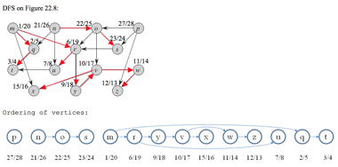

### Exercises 22.4-1
Show the ordering of vertices produced by TOPOLOGICAL-SORT when it is run on the dag
of Figure 22.8, under the assumption of Exercise 22.3-2.

### `Answer`

### Exercises 22.4-2
***
Give a linear-time algorithm that takes as input a directed acyclic graph G = (V, E) and two vertices s and t, and returns the number of paths from s to t in G. For example, in the directed acyclic graph of Figure 22.8, there are exactly four paths from vertex p to vertex v: pov, por yv, posr yv, and psr yv. (Your algorithm only needs to count the paths, not list them.)

### `Answer`
Add a field to the vertex representation to hold an integer count. Initially, set vertex t’s count to 1 and other vertices’ count to 0. Start running DFS with s as the start vertex. When t is discovered, it should be immediately marked as finished (BLACK), without further processing starting from it. Subsequently, each time DFS finishes a vertex v, set v’s count to the sum of the counts of all vertices adjacent to v. When DFS finishes vertex s, stop and return the count computed for s.

### Exercises 22.4-3
***
Give an algorithm that determines whether or not a given undirected graph G = (V, E)
contains a cycle. Your algorithm should run in O(V) time, independent of |E|.

### `Answer`
An undirected graph is acyclic (i.e., a forest) iff a DFS yields no back edges.
Since back edges are those edges (u, v) connecting a vertex u to an ancestor
v in a depth-first tree, so no back edges means there are only tree edges, so
there is no cycle.

So we can simply run DFS. If find a back edge, there is a cycle. The complexity
is O(V ) instead of O(E + V ). Since if there is a back edge, it must
be found before seeing |V | distinct edges. This is because in a acyclic (undirected
) forest, |E| ≤ |V | - 1

### Exercises 22.4-4
***
Prove or disprove: If a directed graph G contains cycles, then TOPOLOGICAL-SORT (G) produces a vertex ordering that minimizes the number of "bad" edges that are inconsistent with the ordering produced.

### `Answer`

This conclusion is not true. Selecting different starting points, topological ordering (according to the depth-first traversal implementation on the book) will give different sequences, and the number of bad edges cannot be guaranteed to be the least.

First explain the meaning of the bad side:

Assuming that the sequence of nodes generated by topological sorting is a, b, c, d, then for the sequence the directed edges d -> a are bad edges, a -> d is not.

Consider the following counterexample:

For the following figure G:

            a
          /  ^\
         /    \\
        V      \V
       b ------> c 

If starting from point a, getting sequence a, b, c, there is 1 bad edge c -> a

If starting from point b and getting the sequence b, c, a, there are 2 bad edges a -> c, a -> b

So the conclusion is not true

			
### Exercises 22.4-5
***
Another way to perform topological sorting on a directed acyclic graph G = (V, E) is to repeatedly find a vertex of in-degree 0, output it, and remove it and all of its outgoing edges from the graph. Explain how to implement this idea so that it runs in time O(V + E). What happens to this algorithm if G has cycles?

### `Answer`

First, run DFS or BFS to count the in and out of each point in O(V+E) time, and then maintain this information when deleting edges. The one with a 0 input each time Click and delete the edge and maintain the information, so there are E edges and V points, so O(V) output and O(E) deletion are performed. So the total running time is O(V+E). )

If the graph has loops, then sometimes there may be no points with a degree of zero.
***
Follow [@louis1992](https://github.com/gzc) on github to help finish this task.

