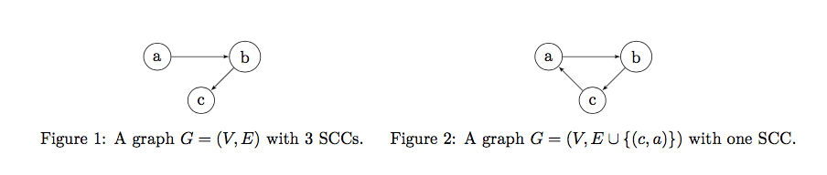
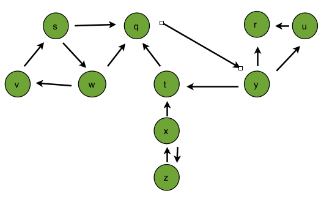

### Exercises 22.5-1
How can the number of strongly connected components of a graph change if a new edge is added?

### `Answer`
* 如果增加的是一个强连通分量里面的边,那么不会影响.
* 如果增加的是不同连通分量之间的边,那么可能不会减少,也可能会减少,最多减少到1.

###### English
* If an edge is added in an SCC, the number of SCCs will remain the same. 
* If an edge is added outside of an SCC, in a graph with n > 0 SCCs, the reduction in SCCs can be between 0 and (n-1).

Example:

### Exercises 22.5-2
***
Show how the procedure STRONGLY-CONNECTED-COMPONENTS works on the graph of Figure 22.6. Specifically, show the finishing times computed in line 1 and the forest produced in line 3. Assume that the loop of lines 5-7 of DFS considers vertices in alphabetical order and that the adjacency lists are in alphabetical order.

### `Answer`
first, we need the finishing times:

~ | q | r | s |	t | u | v |	w |	x |	y |	z
:---:|:---:|:---:|:---:|:---:|:---:|:---:|:---:|:---:|:---:|:---:
d | 1 | 17 | 2 | 8  | 18 |	3 |	4 |9  |	13 | 10
f | 16|	20 | 7 | 15 | 19 |	6 |	5 |12 |	14 | 11

Then, we need to compute the transpose:

Finally, we need the finishing times of the transpose with respect to the original finishing times:

~ | q | r | s |	t | u | v |	w |	x |	y |	z
:---:|:---:|:---:|:---:|:---:|:---:|:---:|:---:|:---:|:---:|:---:
d | 5 | 1 | 15 | 7  | 3 |	17 | 16 | 11 |	6 | 12
f | 10|	2 | 20 | 8 | 4 | 18 | 19 |14 |	9 | 13

Giving us the following components:
{r} -> {u} -> {q, y, t} -> {x, z} -> {s, w, v} 

[reference](http://student.csuci.edu/~douglas.holmes253/Assignment6.html)

### Exercises 22.5-3
***
Professor Deaver claims that the algorithm for strongly connected components can be simplified by using the original (instead of the transpose) graph in the second depth-first search and scanning the vertices in order of increasing finishing times. Is the professor correct?

### `Answer`
Consider vertex1 to vertex0 vertex0 to vertex2 and vertex0 to vertex1
For this algorithm, the first DFS will give a list 1 2 0 for the second DFS. All vertices will be incorrectly reported to be in the same SCC.
For the CLRS algorithm, the first DFS will give a list 0 2 1 for the second DFS. After reversing edges, the correct SCCs {0, 1} and {2} will be reported.

### Exercises 22.5-4
***
Prove that for any directed graph G, we have ((GT)SCC)T = GSCC. That is, the transpose of the
component graph of GT is the same as the component graph of G.

### `Answer`
Since the strongly connected relationship is an equivalence relation, G and GT will always have the same strongly connected components.  If two vertices X and Y are not strongly connected, then there is a unique path from X to Y in G iff there is a unique path from Y to X in GT.

A similar property will also hold for the component graph and transpose of the component graph, i.e. If two vertices X and Y are not strongly connected in G, then here is a unique path from SCC(G,X) to SCC(G,Y) in (G)SCC iff there is a unique path from SCC(GT,Y) to SCC(GT,X) in (GT)SCC).
			
### Exercises 22.5-5
***
Give an O(V + E)-time algorithm to compute the component graph of a directed graph G = (V, E). Make sure that there is at most one edge between two vertices in the component graph your algorithm produces.

### `Answer`
先执行STRONGLY-CONNECTED-COMPONENTS过程,然后对每个节点赋予[1,k]中的一个值,即生成的k个强联通分量.第k个强联通分量里面的所有节点的值为k. 然后遍历每一个节点i,对Adj[i]的每一个节点j, 如果k[i]和k[j]以前没有边,则加上. 

###### English
First execute the STRONGLY-CONNECTED-COMPONENTS process, and then assign each node a value in [1, k], that is, the generated k strongly connected components. The value of all nodes in the kth strongly connected components is k. Then Traversing each node i, for each node j of Adj[i], if k[i] and k[j] have no edges before, then add.

### Exercises 22.5-6
***
Given a directed graph G = (V, E), explain how to create another graph G′ = (V, E′) such that (a) G′ has the same strongly connected components as G, (b) G′ has the same component graph as G, and (c) E′ is as small as possible. Describe a fast algorithm to compute G′.

### `Answer`
1. 先对原图G生成k个联通分量和一个SCC子图.

2. 遍历k个所有的联通分量. 对每个联通分量,必然有一个能够到所有点的回路,只添加该回路到新的图.假设第i个联通分量有5个节点a,b,c,d,e,我们只需要添加边a->b,b->c,c->d,d->e,e->a即可.

3. 选SCC子图的边,加到新的图. 节点可以任意选择.

###### English
1. Generate k connectivity components and an SCC submap for the original graph G.

2. Traverse all k connected components. For each connected component, there must be a loop that can reach all points, and only add the loop to the new graph. Suppose the i-th connected component has 5 nodes a, b, c , d, e, we only need to add the edges a->b, b->c, c->d, d->e, e->a.

3. Select the edge of the SCC submap and add it to the new graph. The nodes can be arbitrarily selected.

### Exercises 22.5-7
***
A directed graph G = (V, E) is semiconnected  if, for all pairs of vertices u, v ∈ V, 
we have u ~> v or v ~> u. Give an efficient algorithm to determine whether
or not G is semiconnected. Prove that your algorithm is correct, and analyze its
running time.

### `Answer`

强连通组件算法, 按第 2 次 DFS(GT) 强连通组件生成顺序编号, 假设是 SCC1, SCC2, ..., SCCn
如果存在边 (SCC1, SCC2), (SCC2, SCC3), ..., (SCCn-1, SCCn) , 即组件间边形成线性的链, 
则图 G 是 semiconnected. 稍后详细解释.

1. 强连通组件图算法, 时间 O(V+E)
2. 按强连通组件 SCC 顺序编号, 假设是SCC1, SCC2, ..., SCCn, 并求出组件 SCC 的邻接表, 
这步骤可以在 (1) 中完成, 所以时间 O(V+E)
3. 遍历 SCC 邻接表, 如果对于范围 i = 1, 2, ..., n-1, 强连通组件SCCi.adj 中存在 SCCi+1 , 
既含有边 (SCCi, SCCi+1), 强连通组件图是线性链, 则 G = (V, E) 是 semiconnected, 时间 O(V+E).
详细解释, 按算法理论的支持, SCCi+1 不存在到SCCi 的边, 如果没有 (SCCi, SCCi+1), 
则两者均无法到达对方, 即不符合 G 是 semiconnected 的概念. 算法时间复杂度 O(V+E)

###### English
Strongly connected component algorithm, numbered according to the second DFS (GT) strong connected component generation sequence, assuming SCC1, SCC2, ..., SCCn
If there are edges (SCC1, SCC2), (SCC2, SCC3), ..., (SCCn-1, SCCn), that is, the edges between the components form a linear chain,
Then the graph G is semiconnected. I will explain it in detail later.

1. Strongly connected component graph algorithm, time O(V+E)
2. According to the SCC sequence of the strong connected component, assume SCC1, SCC2, ..., SCCn, and find the adjacency list of the component SCC.
This step can be done in (1), so time O(V+E)
3. Traverse the SCC adjacency list, if there is SCCi+1 in the strongly connected component SCCi.adj for the range i = 1, 2, ..., n-1,
Contains both edges (SCCi, SCCi+1), strongly connected component graphs are linear chains, then G = (V, E) is semiconnected, time O(V+E).
Detailed explanation, according to the support of algorithm theory, SCCi+1 does not exist to the side of SCCi, if not (SCCi, SCCi+1),
Then neither can reach the other party, that is, it does not conform to the concept that G is semiconnected. Algorithm time complexity O(V+E)

[reference](http://blog.csdn.net/anye3000/article/details/9791213)

***
Follow [@louis1992](https://github.com/gzc) on github to help finish this task.

