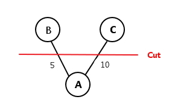
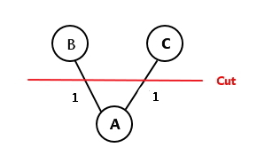
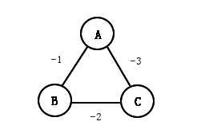
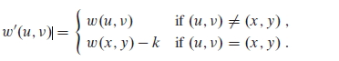

### Exercises 23.1-1
***
Let (u, v) be a minimum-weight edge in a graph G. Show that (u, v) belongs to some
minimum spanning tree of G.

### `Answer`
过程GENERIC-MST的第一步.我们可以选择这样一条割,u在割的一边,v在另一边.此时,u-v就是一条通过割的轻边,把它加进来是安全的.

In the first step of GENERIC-MST, we could choose such a cut, node u is on one side, node v is on another side. Then(u, v) is a light-edge through this cut. So, it is safe to add (u, v)

### Exercises 23.1-2
***
Professor Sabatier conjectures the following converse of Theorem 23.1. Let G = (V, E) be a connected, undirected graph with a real-valued weight function w defined on E. Let A be a subset of E that is included in some minimum spanning tree for G, let (S, V - S) be any cut of G that respects A, and let (u, v) be a safe edge for A crossing (S, V - S). Then, (u, v) is a light edge for the cut. Show that the professor's conjecture is incorrect by giving a counterexample.

### `Answer`

对于该 cut 来说, 虽然 (A, C) 是安全的, 但不是最轻边. 

For this cut, although (A, C) is safe, but is it not the lightest.

### Exercises 23.1-3
***
Show that if an edge (u, v) is contained in some minimum spanning tree, then it is a light edge crossing some cut of the graph.

### `Answer`

在这个MST里边,我们先去掉u-v这条边.然后画一个只穿过u-v的割(这个割肯定存在).此时,我们的策略是选择一条轻边,既然u-v之前在这个MST里边,那么u-v就是一条轻边.
				
In this MST, we remove (u,v) and draw a cut cross (u,v). Now, our strategy is choose a light-weight edge, because (u,v) is in this MST originally, then (u,v) is a light edge.

### Exercises 23.1-4
***
Give a simple example of a graph such that the set of edges {(u, v) : there exists a cut (S, V - S) such that (u, v) is a light edge crossing (S, V - S)} does not form a minimum spanning tree.

### `Answer`
当三角形三条边权重相同时,每条边在某种 cut 中均是最轻,即结果中存在环,所以不是最小生成树.

For example, if we have a triangle with equal weight. In each cut, there will be two equal edge e1 and e2. If we choose e1 into MST, though e2 is also a light weight but it is not in the MST.

### Exercises 23.1-5
***
Let e be a maximum-weight edge on some cycle of G = (V, E). Prove that there is a minimum spanning tree of G′ = (V, E -{e}) that is also a minimum spanning tree of G. That is, there is a minimum spanning tree of G that does not include e.

### `Answer`
因为e是该回路上的最大权边,因此选择这个回路上的其他边都优于选择e.所以G′和G肯定会有一个不含e的MST.

Becase e is the maximum-weight edge in this circle. So other edges in the circle are all better than e. As a result, G and G' must have a MST not containging e.

### Exercises 23.1-6
***
Show that a graph has a unique minimum spanning tree if, for every cut of the graph, there is a unique light edge crossing the cut. Show that the converse is not true by giving a counterexample.

### `Answer`
假设存在两个最小生成树 T 和 T'. 对任意一条边 e 属于 T, 如果从 T 中移除 e, 则 T 变得不连通, 形成 cut (S, V - S), 根据练习 23.1-3 可知, e 是穿过 cut(S, V - S) 最轻边. 假设边 x 属于 T', 并穿过 cut (S, V - S), 则 x 同样是最轻边. 由于穿过 cut(S, V - S) 的最轻边唯一. 既 e 和 x 是同一条边. 所以 e 也属于 T', 由于我们选择 e 是任意的, 所有在 T 中的边, 同样在 T' 中. 即最小生成树唯一.

Assuming there are two MSTs called T and T'. For any edge e in T, if we remove e from T, then T becomes unconnected and we have a cut(S, V - S). According to exercise 23.1-3, e is the light edge through cut(S, V - S). If edge x is in T' and through cut(S, V - S), then x is also a light weight. Because the light edge is unique. So e and x is the same edge, e is also in T'. Because we choose e at random, of all edges in T, also in T'. As a result, the MST is unique.
 
将条件和结论调换则不成立, 如下.

If inverse, then does not hold. See the picture.

### Exercises 23.1-7
***
Argue that if all edge weights of a graph are positive, then any subset of edges that connects all vertices and has minimum total weight must be a tree. Give an example to show that the same conclusion does not follow if we allow some weights to be nonpositive.

### `Answer`
假设边的子集 T 中存在环, 则某两点之间存在多条通路, 移除其中一条通路, 子集 A' 仍然连通所有点. 因为边的权重为正, 既 w(A') < w(A), 结论与条件矛盾, 所以 T 是树. 

Assuming any subset of edges contain circles, then there must be points u,v, the path from u to v is not unique. If we remove a path, subset A' also connects all the points. Because the weight is positive, w(A') < w(A). There is a confliction, because we can produce smaller graph. So no circles, it must be a tree.

如果边的权重准许为负, 则子集 T 不一定是树, 图中三条边总权重最小, 如下.

If some weights could be nonpositive, see picture below. It is a graph with total minimum weights.

### Exercises 23.1-8
***
Let T be a minimum spanning tree of a graph G, and let L be the sorted list of the edge weights of T. Show that for any other minimum spanning tree T′ of G, the list L is also the sorted list of edge weights of T′.

### `Answer`
假设最小生成树有 n 条边, 存在两个最小生成树 T 和 T', 用 w(e) 表示边的权值.
T 权值递增排列 w(a1) <= w(a2) <= ... w(an)
T' 权值递增排列 w(b1) <= w(b2) <= ... w(bn)
假设 i 是两个列表中, 第一次出现边不同的位置, 既 ai ≠ bi, 先假定 w(ai) >= w(bi).

情况1, 如果 T 中含有边 bi, 由于 ai 和 bi 在列表 i 位置之前都是相同的, 若含有 bi 则一定在 i 位置后, 既有 j > i 使得 w(aj) = w(bi). 得到 w(bi) = w(aj) >= w(ai) >= w(bi), 既 w(bi) = w(aj) = w(ai), 故 i 位置处边的权值相同.

情况2, 如果 T 不包含边 bi, 则把 bi 加到 T 中, 会在某处形成一个圈. 由于 T 是最小生成树, 圈内任何一条边的权值都小于等于 w(bi), 另外这个圈中必定存在 aj 不在 T' 中, 得出 w(aj) <= w(bi) 且 j > i. 因此 w(bi) <= w(ai) <= w(aj) <= w(bi), 既 w(bi) = w(aj) = w(ai), 故 i 位置处边的权值仍相同.

Assuming MST contains n edges, there existing two MST T and T', w(e) stand for the weight of edge e.  
For T  <code> w(a1) <= w(a2) <= ... w(an) </code> 
For T' <code> w(b1) <= w(b2) <= ... w(bn) </code> 
Also assuming i is the first occuring index where ai ≠ bi, let's assume w(ai) >= w(bi).

**Condition 1** : If bi is in T, because the preceeding edges befor ai and bi are same, if T containing bi then bi must after ai. So there existing j > i, w(aj) = w(bi). Which produce w(bi) = w(aj) >= w(ai) >= w(bi). So w(ai) = w(bi).

**Condition 2** : If bi is not in T, then adding bi to T will produce a circle. Because T is MST, any weights of nodes in this circle will be less or equal than w(bi). Besides, in this circles, there must exiting aj which not in T' and have w(aj) <= w(bi), j > i.
So, w(bi) <= w(ai) <= w(aj) <= w(bi), w(bi) = w(aj) = w(ai).

### Exercises 23.1-9
***
Let T be a minimum spanning tree of a graph G = (V, E), and let V′ be a subset of V. Let T′ be the subgraph of T induced by V′, and let G′ be the subgraph of G induced by V′. Show that if T′ is connected, then T′ is a minimum spanning tree of G′.

### `Answer`
用 cut (V', V - V') 分割图 G, 该 cut 一定不影响 T', 且 T' 是 T 的子集, 所以 T' 对于 G' 是安全的. 如果 T' 是连通的, 则 T' 一定是 G' 的最小生成树.

We use cut(V', V - V') to cut graph. This cut will not influence T' and T' is the subset of T, so to G', T' is safe. if T′ is connected, then T′ is a minimum spanning tree of G.

### Exercises 23.1-10
***
Given a graph G and a minimum spanning tree T , suppose that we decrease the weight of one of the edges in T . Show that T is still a minimum spanning tree for G. More formally, let T be a minimum spanning tree for G with edge weights given by weight function w. Choose one edge (x, y) ∈ T and a positive number k, and define the weight function w' by

Show that T is a minimum spanning tree for G with edge weights given by w′.

### `Answer`
We prove by cut. Originally, (x,y) is the light edge in a certain cut(V1, V2). Decreasing the weight of (x,y), (x,y) is still a light edge. So T is a minimum spanning tree for G with edge weights given by w′.

### Exercises 23.1-11 *
Given a graph G and a minimum spanning tree T , suppose that we decrease the weight of one of the edges not in T . Give an algorithm for finding the minimum spanning tree in the modified graph.

### `Answer`
假设 (u, v) 不在最小生成树 T 中, 减小 (u, v) 权值后, 形成新的最小生成树 T'. 可能的情况是 T' 包含 (u, v) 或者 T' = T 保持不变. 算法只需寻找 T 中 u -> v 路径中权值最重边 x, 如果该边权值大于 (u, v), 则 T' = T - x + (u, v). 如果 (u, v) 权值大于 x, 则 T' = T. 路径可用 DFS 算法求得, 从 u 开始 v 结束. 因为 T 是最小生成树, 所以路径唯一, 时间 O(V+E).

If(u,v) is not in MST, decrease the weight of(u, v), we may form a new MST T'.

**Condition 1** : if the weightest edge e in path from u->v is greater than edge(u,v).Then we can replace e with (u,v).

**Condition 2** : if the weightest edge e in path from u->v is less or equal than edge(u,v).Then we need not change,

***
Follow [@louis1992](https://github.com/gzc) on github to help finish this task.

本节部分答案参考自[这里](http://blog.csdn.net/anye3000/article/details/12091125)

