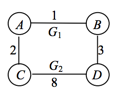
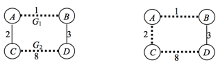

### Exercises 23.2-1
***
Kruskal's algorithm can return different spanning trees for the same input graph G, depending on how ties are broken when the edges are sorted into order. Show that for each minimum spanning tree T of G, there is a way to sort the edges of G in Kruskal's algorithm so that the algorithm returns T.

### `Answer`
产生不同的MST的原因就在于当有几条相同的边时选择的顺序不一样.

The reason why there may be several different MST is that we have several choices on same weighted edge.

Given a minimum spanning tree T we wish to sort the edges in Kruskal’s algorithm such that it produces T. For each edge e in T simply make sure that it preceeds any other edge not in T with weight w(e).

### Exercises 23.2-2
***
Suppose that the graph G = (V, E) is represented as an adjacency matrix. Give a simple
implementation of Prim's algorithm for this case that runs in O(V^2) time.

### `Answer`

	MST-PRIM(G, w, r)
		for each u ∈ V[G]
			do key[u] <- ∞
				 π[u] <- NIL
		key[r] <- 0
		Q <- V[G]
		while !isEmpty(Q)
			do u <- EXTRACT-MIN(Q)
				for i <- 1 to n
					do if MATRIX[u][i] == 1 and i ∈ Q and w(u,i) < key[i]
						then π[i] <- u
							 key[i] <- w(u, i)

### Exercises 23.2-3
***
Is the Fibonacci-heap implementation of Prim's algorithm asymptotically faster than the binary-heap implementation for a sparse graph G = (V, E), where |E| = Θ(V)? What about for a dense graph, where |E| = Θ(V2)? How must |E| and |V| be related for the Fibonacci-heap implementation to be asymptotically faster than the binary-heap implementation?

### `Answer`
Consider the running times of Prims algorithm implemented with either a binary heap or a Fibon-nacci heap. Suppose |E| = Θ(V) then the running times are: 

• Binary: O(ElgV) = O(V lgV)

• Fibonnacci: O(E+VlgV)=O(VlgV)

If |E| = Θ(V2) then:

• Binary:O(ElgV)=O(V2lgV)

• Fibonnacci: O(E + V lg V) = O(V2)

The Fibonnacci heap beats the binary heap implementation of Prims algorithm when |E| = ω(V) since O(E+VlgV) = O(VlgV) t for |E| = O(VlgV) but O(ElgV) = ω(VlgV) for |E| = ω(V ). For |E| = ω(V lg V ) the Fibonnacci version clearly has a better running time than the ordinary version.
				

### Exercises 23.2-4
***
Suppose that all edge weights in a graph are integers in the range from 1 to |V|. How fast can you make Kruskal's algorithm run? What if the edge weights are integers in the range from 1 to W for some constant W?

### `Answer`
If w is a constant we can use **counting sort**

• Sorting the edges: O(E lg E) time.

• O(E) operations on a disjoint-set forest taking O(Eα(V)).

The sort dominates and hence the total time is O(E lg E). Sorting using counting sort when the edges fall in the range 1, . . . , |V | yields O(V + E) = O(E) time sorting. The total time is then O(Eα(V )). If the edges fall in the range 1, . . . , W for any constant W we still need to use Ω(E) time for sorting and the total running time cannot be improved further. 

### Exercises 23.2-5
***
Suppose that all edge weights in a graph are integers in the range from 1 to |V|. How fast can you make Prim's algorithm run? What if the edge weights are integers in the range from 1 to W for some constant W?

### `Answer`
The running time of Prims algorithm is composed :

• O(V) initialization.

• O(V · time for EXTRACT-MIN). 

• O(E · time for DECREASE-KEY).

If the edges are in the range 1, . . . , |V| the Van Emde Boas priority queue can speed up EXTRACT- MIN and DECREASE-KEY to O(lg lg V) thus yielding a total running time of O(V lg lg V +E lg lg V) = O(E lg lg V ). If the edges are in the range from 1 to W we can implement the queue as an array [1...W+1] where the ith slot holds a doubly linked list of the edges with weight i. The (W+1)st slot contains ∞. EXTRACT-MIN now runs in O(W) = O(1) time since we can simply scan for the first nonempty slot and return the first element of that list. DECREASE-KEY runs in O(1) time as well since it can be implemented by moving an element from one slot to another.

### Exercises 23.2-6 *
***
Suppose that the edge weights in a graph are uniformly distributed over the half-open interval
[0, 1). Which algorithm, Kruskal's or Prim's, can you make run faster?

### `Answer`
Kruskal, using bucket sort.

### Exercises 23.2-7 *
***
Suppose that a graph G has a minimum spanning tree already computed. How quickly can the
minimum spanning tree be updated if a new vertex and incident edges are added to G?

### `Answer`
如果只有一条边,只需要将这个顶点和这条边加进去.

如果有k(k > 1)条边,那么需要删去k-1条边.

假设新节点是v,那么从v必然有一些回路. 遍历k-1次,每次都能找到一个回路,从该回路中删除一条权值最大的边.

If there is only one edge, just add this edge.

If there are k(k > 1) edges, then we need to remmove k-1 edges. We can find cycles by Union-Find and remove the weightest edge in an union. This algorithm need (k-1) passes.

### Exercises 23.2-8
***
Professor Toole proposes a new divide-and-conquer algorithm for computing minimum spanning trees, which goes as follows. Given a graph G = (V, E), partition the set V of vertices into two sets V1 and V2 such that |V1| and |V2| differ by at most 1. Let E1 be the set of edges that are incident only on vertices in V1, and let E2 be the set of edges that are incident only on vertices in V2. Recursively solve a minimum-spanning-tree problem on each of the two subgraphs G1 = (V1, E1) and G2 = (V2, E2). Finally, select the minimum-weight edge in E that crosses the cut (V1, V2), and use this edge to unite the resulting two minimum spanning trees into a single spanning tree.

Either argue that the algorithm correctly computes a minimum spanning tree of G, or provide an example for which the algorithm fails.

### `Answer`
We argue that the algorithm fails. Consider the graph G below. We partition G into V1 and V2 as follows: V1 = {A, B}, V2 = {C,
D}. E1 = {(A, B)}. E2 = {(C, D)}. The set of edges that cross the cut is Ec = {(A, C), (B, D)}.

Now, we must recursively find the minimum spanning trees of G1 and G2. We can see that in this case, MST(G1) = G1 and MST(G2) = G2. The minimum spanning trees of G1 and G2 are shown below on the left.

The minimum weighted edge of the two edges across the cut is edge (A, C). So (A, C) is used to connect G1 and G2. This is the minimum spanning tree returned by Professor Borden’s algorithm. It is shown below and to the right.

We can see that the minimum-spanning tree returned by Professor Borden’s algorithm is not the minimum spanning tree of G, therefore, this algorithm fails.

[reference](http://test.scripts.psu.edu/users/d/j/djh300/cmpsc465/notes-4985903869437/solutions-to-some-homework-exercises-as-shared-with-students/4-solutions-clrs-23.pdf)

***
Follow [@louis1992](https://github.com/gzc) on github to help finish this task.

本节部分答案参考自[这里](http://blog.csdn.net/anye3000/article/details/12091125)

