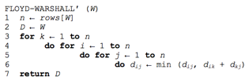
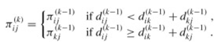

### Exercises 25.2-1
***
Run the Floyd-Warshall algorithm on the weighted, directed graph of Figure 25.2. Show the matrix D(k) that results for each iteration of the outer loop.

### `Answer`

straightforward.

### Exercises 25.2-2
***
Show how to compute the transitive closure using the technique of Section 25.1.

### `Answer`
将EXTEND-SHORTEST-PATHS中第7行的min换成**OR**,+换成**AND**

### Exercises 25.2-3
***
Modify the FLOYD-WARSHALL procedure to include computation of the Π(k) matrices according to equations (25.6) and (25.7). Prove rigorously that for all i ∈ V , the predecessor subgraph Gπ,i is a shortest-paths tree with root i.

### `Answer`
证明分三步：
1. 无环。
每次循环过程中，一定有 dij(k) <= dij(k - 1)。
首先证明如果检验dij(k)之后有 πij(k) = l，则 dij(k) >= dil(k) + wlj。
检验dij(k)的过程中，
	若 dij(k - 1) <= dik(k - 1) + dkj(k - 1)，有 dij(k) = dij(k - 1)，πij(k) = πij(k - 1) 都为l，l 存在于 (1, 2, ... , k - 1) 中。
	k - 1 次循环在此时已经完成，故有 dij(k) = dij(k - 1) = dil(k - 1) + wlj >= dil(k) + wlj。

	若 dij(k - 1) > dik(k - 1) + dkj(k - 1)，有 dij(k) = dik(k - 1) + dkj(k - 1)，必然有 πij(k) = πkj(k - 1) 都为l，l 存在于 (1, 2, ... , k - 1) 中。
	k - 1 次循环在此时已经完成，故有 dij(k) = dik(k - 1) + dkj(k - 1) = dik(k - 1) + dkl(k - 1) + wlj，又因为dil(k - 1) <= dik(k - 1) + dkl(k - 1)（dil(k - 1) 是最短路径权重），有 dij(k) >= dil(k - 1) + wlj >= dil(k) + wlj。
现在假设Gπ,i中存在环路 (v0, v1, ... , vs)，vs = v0，πip(k) = p - 1，p = 1, 2, ... , s。不失一般性，假设 πis(k) = s - 1 是形成环的最后一步，这一步之前 πis(k) != s - 1。那么这一步之前一定有 dij(k) > dil(k) + wlj。此时，将所有 (v0, v1, ... , vs)对应的式子累加起来，有 Σdij(k) > Σdil(k) + Σwlj，j = 1, 2, ... , s，l = 0, 1, ... , s - 1，有Σwlj < 0，j = 1, 2, ... , s，l = 0, 1, ... , s - 1，这与Floyd-Wallshall算法基本假设 不存在权重为负的环 矛盾。

2. Gπ,i 是一棵以 i 为根的有根树。
因为 πij 记录了从 i 到 j 的路径中j的前驱点，Gπ,i 只取 πij 不为空的点，根据归纳法容易证明 Gπ,i 中存在 i 到 Gπ,i 中任意点的简单路径。下面证明这种简单路径唯一。
假设 i 到 j 有不止一条简单路径，设其中两条为 i~>p~>x->z~>j 和 i~>p~>y->z~>j，对于z点，有 πiz = x 同时 πiz = y，有 x = y，这两条路径为一条。同样的方法可以证明所有路径其实是一条，与假设矛盾。

3. Gπ,i 包含的一定是 i 到每个点的最短路径。根据算法过程可知正确。
				

### Exercises 25.2-4
***
As it appears above, the Floyd-Warshall algorithm requires Θ(n3) space, since we compute for i, j, k = 1, 2,...,n. Show that the following procedure, which simply drops all the superscripts, is correct, and thus only Θ(n2) space is required.

### `Answer`
当然是正确的,因为这个动态规划只需要保存上一个状态.也就是要计算当前这个状态只需要借助上一个状态.

### Exercises 25.2-5
***
Suppose that we modify the way in which equality is handled in equation (25.7):

Is this alternative definition of the predecessor matrix Π correct?

### `Answer`
感觉正确呀.

### Exercises 25.2-6
***
How can the output of the Floyd-Warshall algorithm be used to detect the presence of a negative-weight cycle?

### `Answer`
只需要在正常的Floyd-Warshall算法完成后再多跑一个循环，如果有一个值还能更新则说明有负权回路。
或者，权重矩阵D对角线上出现了负值。

### Exercises 25.2-7
***
Another way to reconstruct shortest paths in the Floyd-Warshall algorithm uses values Φij(k) for
i, j, k = 1, 2,..., n, where Φij(k) is the highest-numbered intermediate vertex of a shortest path from i to j in which all intermediate vertices are in the set {1, 2,..., k}. Give a recursive formulation for  Φij(k) , modify the FLOYD-WARSHALL procedure to compute the Φij(k) values, and rewrite the PRINT-ALL-PAIRS-SHORTEST-PATH procedure to take the matrix Φ = (Φij(n)) as an input. How is the matrix Θ like the s table in the matrix-chain multiplication problem of Section 15.2?

### `Answer`

				Φij(k－1)   如果dij(k-1) <= dik(k-1) + dkj(k-1) 
	Φij(k) ＝ 
				k			otherwise
				

	PRINT-ALL-PAIRS-SHORTEST-PATH(Φ,i,j)
		if i == j
			then print i
		else if Φ(i,j) = -1
			then print "no path from 'i' to 'j' exists"
		else
			PRINT-ALL-PAIRS-SHORTEST-PATH(Φ,i,Φ(i, j))
			PRINT-ALL-PAIRS-SHORTEST-PATH(Φ,Φ(i, j),j)

### Exercises 25.2-8
***
Give an O(V E)-time algorithm for computing the transitive closure of a directed graph G =
(V, E).

### `Answer`
对每个节点都跑一次DFS. 一共V个点,E条边，所以是O(VE)的时间.

### Exercises 25.2-9
***
Suppose that the transitive closure of a directed acyclic graph can be computed in f(|V|,|E|) time, where f is a monotonically increasing function of |V| and |E|. Show that the time to compute the transitive closure `G* = (V, E*)` of a general directed graph G = (V, E) is f(|V|,|E|) + O(V + E*).

### `Answer`
首先随便选择一个点开始DFS，搜索中如果遇到灰色的点说明有环，把这一次搜索用到的边 (u, v) 记录下来，并从E中删除。这个操作复杂度 `O(V + E) <= O(V + E*)`。这个操作之后有环图变成了无环图，运行f(|V|, |E|)算法，得到不完整的传递闭包。
结束后，遍历被删除的边，连接u和v，以及所有v能到达的点。由于记录 (u, v) 不会重复，遍历过程最多把不完整的传递闭包每条边遍历一遍，外加被删除的边（这些边一定存在于`E*`中），因此复杂度为`O(E*)`。
因此，这个算法总的复杂度为`f(|V|, |E|) + O(V + E*)`。

***
Follow [@louis1992](https://github.com/gzc) on github to help finish this task.
