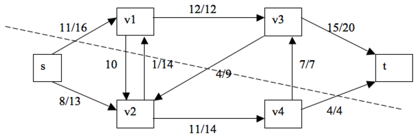
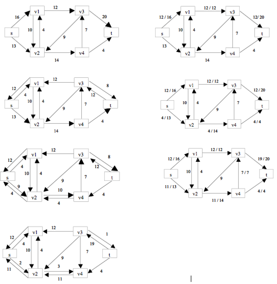

I get some answers from the web but I forgot the link, pretty sorry.

### Exercises 26.2-1
***

In Figure 26.1(b), what is the flow across the cut ({s, v2, v4}, {v1, v3, t})? What is the capacity of this cut?

### `Answer`

Net flow across the cut is f(s, v1) + f(v2,v1) + f(v2,v3) + f(v3,v4) + f(v4,t) = 11 + 1 + -4 + 7 + 4 = 19 and its capacity is = 16 + 14 +7 + 4 = 41

### Exercises 26.2-2
***
Show the execution of the Edmonds-Karp algorithm on the flow network of Figure 26.1(a).

### `Answer`

### Exercises 26.2-3
***
In the example of Figure 26.5, what is the minimum cut corresponding to the maximum flow shown? Of the augmenting paths appearing in the example, which two cancel flow?

### `Answer`
c and d.

### Exercises 26.2-4
***
Prove that for any pair of vertices u and v and any capacity and flow functions c and f, we have cf(u, v) + cf(v, u) = c(u, v) + c(v, u).

### `Answer`
UNSOLVED

### Exercises 26.2-5
***
Recall that the construction in Section 26.1 that converts a multisource, multisink flow network into a single-source, single-sink network adds edges with infinite capacity. Prove that any flow in the resulting network has a finite value if the edges of the original multisource, multisink network have finite capacity.

### `Answer`
Because we could find a minimum cut which only include finite weight edges.

### Exercises 26.2-6
***
Suppose that each source si in a multisource, multisink problem produces exactly pi units of flow, so that f(si, V) = pi. Suppose also that each sink tj consumes exactly qj units, so that f(V, tj) = qj, where Σi pi = Σj qj. Show how to convert the problem of finding a flow f that obeys these additional constraints into the problem of finding a maximum flow in a single-source, single-sink flow network.

### `Answer`
v is the virtual start point. If f(si, V) = q, then c(v, si) = q.

### Exercises 26.2-7
***
Prove Lemma 26.3.

### `Answer`
UNSOLVED

### Exercises 26.2-8
***
Show that a maximum flow in a network G = (V, E) can always be found by a sequence of at most |E| augmenting paths. (Hint: Determine the paths after finding the maximum flow.)

### `Answer`
[reference](http://www.cise.ufl.edu/class/cot5405sp08/assignments/hw4Sol.pdf)

The solution to this question is fairly straight forward. First you find the maximum flow. Then you could get the minimum cut of the network. We also know that you saturate one edge on the minimum cut each time. Thus, the upper bound is simply |E|.

### Exercises 26.2-9
***
The **edge connectivity** of an undirected graph is the minimum number k of edges that must be removed to disconnect the graph. For example, the edge connectivity of a tree is 1, and the edge connectivity of a cyclic chain of vertices is 2. Show how the edge connectivity of an undirected graph G = (V, E) can be determined by running a maximum-flow algorithm on at most |V| flow networks, each having O(V) vertices and O(E) edges.

### `Answer`
Each edge has same weight, find the minimum cut.

### Exercises 26.2-10
***
Suppose that a flow network G = (V, E) has symmetric edges, that is, (u, v) ∈ E if and only if (v, u) ∈ E. Show that the Edmonds-Karp algorithm terminates after at most |V| |E|/4 iterations. (Hint: For any edge (u, v), consider how both δ(s, u) and δ(v, t) change between times at which (u, v) is critical.)

### `Answer`
From the time (u, v) becomes critical to the time when it NEXT becomes crticial, the distance of u from source increases by at least 2, and the distance of v to sink increases by at least 2. The distance from source to u is at most |V|-2, so it can be critical for at most |V|/4 times. Given |E| edges, thus the result is |V||E|/4. 

***
Follow [@louis1992](https://github.com/gzc) on github to help finish this task.

