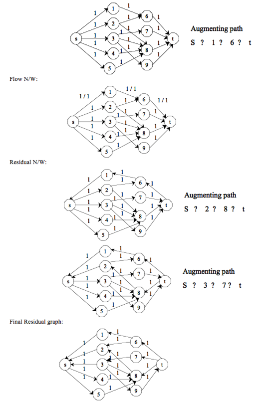
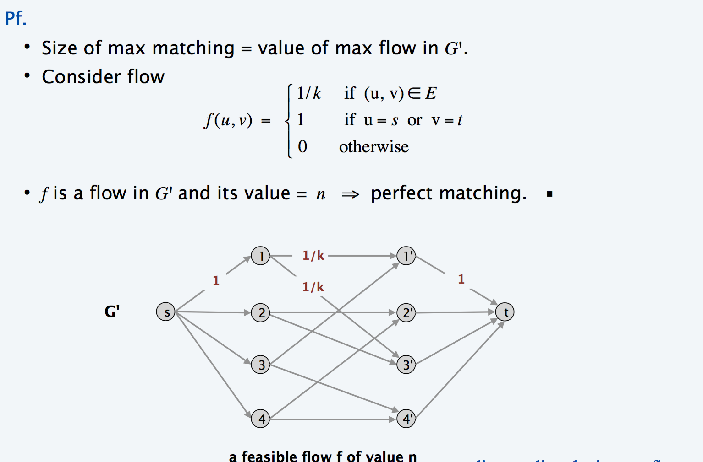

### Exercises 26.3-1
***
Run the Ford-Fulkerson algorithm on the flow network in Figure 26.8(b) and show the residual network after each flow augmentation. Number the vertices in L top to bottom from 1 to 5 and in R top to bottom from 6 to 9. For each iteration, pick the augmenting path that is lexicographically smallest.

### `Answer`

### Exercise 26.3-5
***
We say that bipartie graph G = (V, E), where V = L ∪ R is d-regular if every vertex v ∈ V has degree exactly d. Every d-regular bipartie graph has |L|=|R|. Prove that every d-regular bipartite graph has a matching of cardinality |L| by arguing that a minimum cut of the corresponding flow network has capacity |L|. 

### `Answer`
Consider the corresponding network flow graph G' to `k`-regular graph G:

***
Follow [@louis1992](https://github.com/gzc) on github to help finish this task.

