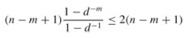
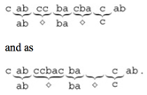

### Exercises 32.1-1
***
Show the comparisons the naive string matcher makes for the pattern P = 0001 in the text T = 000010001010001.

### `Answer`

straightforward.

### Exercises 32.1-2
***
Suppose that all characters in the pattern P are different. Show how to accelerate NAIVE-
STRING-MATCHER to run in time O(n) on an n-character text T.

### `Answer`
If p[i] dismatch T[j],next time trace back to j+1;That is,compare from p[0] and T[j+1].

### Exercises 32.1-3
***
Suppose that pattern P and text T are randomly chosen strings of length m and n, respectively, from the d-ary alphabet Σd = {0, 1, . . . , d - 1}, where d ≥ 2. Show that the expected number of character-to-character comparisons made by the implicit loop in line 4 of the naive algorithm is

over all executions of this loop. (Assume that the naive algorithm stops comparing characters for a given shift once a mismatch is found or the entire pattern is matched.) Thus, for randomly chosen strings, the naive algorithm is quite efficient.

### `Answer`
It's a probability problem.

	assume we have to compare (n-m+1) times.
						a(n)	b(n)
	each time: compare  1	1-1/d
						2	1/d*(1-1/d)
						3	(1/d)^2*(1-1/d)
						...	...
						m	(1/d)^(m-1)*(1-1/d)
	then wo can get the T(time) = (n-m+1)*[a(1)*b(1)+a(2)*b(2)+,,,+a(m)*b(m)] 
	So we get the answer.

				

### Exercises 32.1-4
***
Suppose we allow the pattern P to contain occurrences of a gap character ⋄ that can match
an arbitrary string of characters (even one of zero length). For example, the pattern ab⋄ba⋄c occurs in the text cabccbacbacab as

Note that the gap character may occur an arbitrary number of times in the pattern but is assumed not to occur at all in the text. Give a polynomial-time algorithm to determine if such a pattern P occurs in a given text T , and analyze the running time of your algorithm.

### `Answer`
To determine if a pattern P with gap characters exists in T partition P into substrings P1 , . . . , Pk determined by the gap characters. Search for P1 and if found continue searching for P2 and so on. This clearly find a pattern if one exists.

***
Follow [@louis1992](https://github.com/gzc) on github to help finish this task
