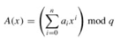

### Exercises 32.2-1
***
Working modulo q = 11, how many spurious hits does the Rabin-Karp matcher encounter in
the text T = 3141592653589793 when looking for the pattern P = 26?

### `Answer`

15,59,92.

So there are 3.

### Exercises 32.2-2
***
How would you extend the Rabin-Karp method to the problem of searching a text string for an occurrence of any one of a given set of k patterns? Start by assuming that all k patterns have the same length. Then generalize your solution to allow the patterns to have different lengths.

### `Answer`
如果k个模式都是等长的,那么算法修改不大.用这些模式模p.然后跑正常的RK算法.遇到有出现在其中的就去匹配一下.

如果不等长,可以按长度划分跑多次RK.

### Exercises 32.2-3
***
Show how to extend the Rabin-Karp method to handle the problem of looking for a given m × m pattern in an n × n array of characters. (The pattern may be shifted vertically and horizontally, but it may not be rotated.)

### `Answer`
核心思想是reduce 2d to 1d.

对长度为n每一列,我们都能根据RK算法计算出(n-m+1)个hash值.然后对每一行的连续的m个hash值,又能够根据RK的hash算法新算出一个值.

也就是说,原来的RK是把算出长度为m的模式的hash值.而现在是先计算出m个长度为m的hash值,再对这m个hash值再一次hash.				

### Exercises 32.2-4
***
Alice has a copy of a long n-bit file A = <an-1, an-2, . . . , a0>, and Bob similarly has an n-bit file B = <bn-1, bn-2, . . . , b0>. Alice and Bob wish to know if their files are identical. To avoid transmitting all of A or B, they use the following fast probabilistic check. Together, they select a prime q > 1000n and randomly select an integer x from {0, 1, . . . , q - 1}. Then, Alice evaluates

and Bob similarly evaluates B(x). Prove that if A ≠ B, there is at most one chance in 1000 that A(x) = B(x), whereas if the two files are the same, A(x) is necessarily the same as B(x). (Hint: See Exercise 31.4-4.)

### `Answer`
UNSOLVED

***
Follow [@louis1992](https://github.com/gzc) on github to help finish this task
