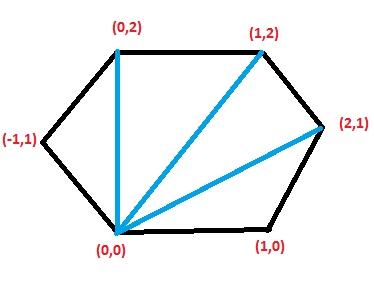

### Exercises 33.1-1
***
Prove that if p1 × p2 is positive, then vector p1 is clockwise from vector p2 with respect to the origin (0, 0) and that if this cross product is negative, then p1 is counterclockwise from p2.

### `Answer`

cross-product是一个三维的概念,根据右手规则,若p1在p2的顺时针方向,右手握住拇指出纸面,这时候的面积是正的;否则,面积是负的.

### Exercises 33.1-2
***
Professor Powell proposes that only the x-dimension needs to be tested in line 1 of ON- SEGMENT. Show why the professor is wrong.

### `Answer`
如何一条直线是竖直的话,不仅要检查x值,还要检查y值.

If a line is vertical, it's not enough to check x-value, y-valuealso needs checking.

### Exercises 33.1-3
***
The polar angle of a point p1 with respect to an origin point p0 is the angle of the vector p1 - p0 in the usual polar coordinate system. For example, the polar angle of (3, 5) with respect to (2, 4) is the angle of the vector (1, 1), which is 45 degrees or π/4 radians. The polar angle of (3, 3) with respect to (2, 4) is the angle of the vector (1, -1), which is 315 degrees or 7π/4 radians. Write pseudocode to sort a sequence [p1, p2, ..., pn] of n points according to their polar angles with respect to a given origin point p0. Your procedure should take O(n lg n) time and use cross products to compare angles.

### `Answer`
Here is the basic idea : if we could define the compare function in points by cross product, we could adopt methods like quicksort to sort the points. 

* if p1 > 0, p2 < 0, then p1 < p2.
* else if p1 < 0, p2 > 0, then p1 > p2.
* else if crossproduct(p1, p2) > 0, then p1 < p2
* else p1 > p2

Once we define this compare function, we could call **sort** in the `algorithm` standard library and pass this function as a parameter.

Here is my [implementation](./exercise_code/polarCMP.cpp)

### Exercises 33.1-4
***
Show how to determine in O(n2 lg n) time whether any three points in a set of n points are collinear.

### `Answer`
Show how to determine if three point are collinear in a set of n points. For each point p0 sort the n − 1 other points according to the polar angle with respect to p. If two points p1 and p2 have the same polar angle then p0, p1 and p2 are collinear. This can approach can be implemented in O(n2 lg n).

For conveience, we will ignore the case in which two points may have same coordinate.

Here is my [implementation](./exercise_code/colinear.cpp)

### Exercises 33.1-5
***
A polygon is a piecewise-linear, closed curve in the plane. That is, it is a curve ending on itself that is formed by a sequence of straight-line segments, called the sides of the polygon. A point joining two consecutive sides is called a vertex of the polygon. If the polygon is simple, as we shall generally assume, it does not cross itself. The set of points in the plane enclosed by a simple polygon forms the interior of the polygon, the set of points on the polygon itself forms its boundary, and the set of points surrounding the polygon forms its exterior. A simple polygon is convex if, given any two points on its boundary or in its interior, all points on the line segment drawn between them are contained in the polygon's boundary or interior.

Professor Amundsen proposes the following method to determine whether a sequence {p0, p1, ..., pn-1} of n points forms the consecutive vertices of a convex polygon. Output "yes" if the set {angle pi pi+1 pi+2 : i = 0, 1, ..., n - 1}, where subscript addition is performed modulo n, does not contain both left turns and right turns; otherwise, output "no." Show that although this method runs in linear time, it does not always produce the correct answer. Modify the professor's method so that it always produces the correct answer in linear time.

### `Answer`
For example, Point(0,0)(1,1)(2,2) form a line not a polygon. But it does not contain both left turns and right turns so Professor Amundsen will say "yes".

So, if these is no left turn or right turn, then say "no". Only if left turn occurs or right turn occurs will we say "yes".

[implementation](./exercise_code/convex_polygon.cpp)

### Exercises 33.1-6
***
Given a point p0 = (x0, y0), the right horizontal ray from p0 is the set of points {pi = (xi, yi) : xi ≥ x0 and yi = y0}, that is, it is the set of points due right of p0 along with p0 itself. Show how to determine whether a given right horizontal ray from p0 intersects a line segment p1p2 in O(1) time by reducing the problem to that of determining whether two line segments intersect.

### `Answer`
The tricky part is how to find an `end` point in the ray. We follow this strategy : The y-coordinate of the end point is the same as p0(y0). We name `xmax = max(p1.x, p2.x)`, to prevent p0 and end-point are same, we set end.x = xmax + 1.

Next, we can apply original algorithm on p0p`end` and p1p2. 

It is my [implementation](./exercise_code/ray_intersection.cpp).

### Exercises 33.1-7
***
One way to determine whether a point p0 is in the interior of a simple, but not necessarily convex, polygon P is to look at any ray from p0 and check that the ray intersects the boundary of P an odd number of times but that p0 itself is not on the boundary of P. Show how to compute in Θ(n) time whether a point p0 is in the interior of an n-vertex polygon P. (Hint: Use Exercise 33.1-6. Make sure your algorithm is correct when the ray intersects the polygon boundary at a vertex and when the ray overlaps a side of the polygon.)

### `Answer`
The difficulty is how to deal with the case when the ray intersects the polygon boundary at a vertex and when the ray overlaps a side of the polygon. I adopt this strategy : when the case occurs, if the line is below my ray(that is to say, one of the y-coordinate < p0.y, and the other >= p0.y) the increase the interaction times else do not.

see my [implementation](./exercise_code/pointpolygon.cpp)

[reference](http://blog.csdn.net/hjh2005/article/details/9246967)

### Exercises 33.1-8
***
Show how to compute the area of an n-vertex simple, but not necessarily convex, polygon in Θ(n) time. (See Exercise 33.1-5 for definitions pertaining to polygons.)

### `Answer`
To calculate the area of an arbitary polygon, we can divide the polygon into a number of triangles.

Then we calculate the area of each triangle and add them.

Here is the [code](./exercise_code/area.cpp).

***
Follow [@louis1992](https://github.com/gzc) on github to help finish this task
