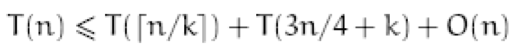

### Exercises 9.3-1
***
In the algorithm SELECT, the input elements are divided into groups of 5. Will the algorithm work in linear time if they are divided into groups of 7? Argue that SELECT does not run in linear time if groups of 3 are used.
### `Answer`
假设现在每个group有k个元素.

小于（或者大于）中位数的中位数的个数至少有n/4-k个，在最坏情况下，下一次调用SELECT会递归调3n/4+k个元素.

因此

假设对所有的n，T(n) <= cn

因此1/k+3/4 <= 1得到k >= 4

### Exercises 9.3-2
***
Analyze SELECT to show that if n ≥ 140, then at least ⌈n/4⌉ elements are greater than the median-of-medians x and at least ⌈n/4⌉ elements are less than x.

### `Answer`

条件满足

***
Follow [@louis1992](https://github.com/gzc) on github to help finish this task.

